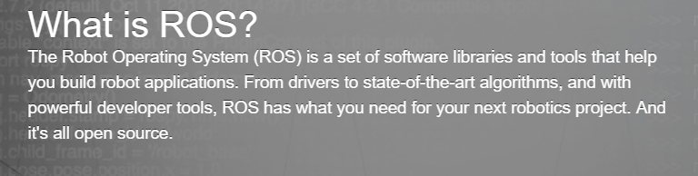

# 1 我们要做什么

## 1.1 ROS Q&A

Q: ROS是什么，它是一个操作系统吗？  

A: 根据ROS官方的定义，ROS是编写机器人软件的一个灵活的框架。它是一个工具、库和协议的集合，旨在简化在各种机器人平台上完成复杂而健壮的机器人行为任务。这句话要怎么理解，还需要亲自上手实践才能体会了。

图1.1 What is ROS

不同于Windows、Linux、Mac，甚至Android、iOS等系统，ROS名字中虽然有Operating System，但它并不是一个传统的操作系统，而是元操作系统(Meta-Operating System)。它需要利用Ubuntu、Windows这些现有的操作系统来完成相关功能。至于元操作系统的内容，当前阶段并不需要花太多时间了解，只需要把ROS看做一个专门为机器人开发应用程序的软件框架(Software framework)和软件平台就好，不要把它当做Operating system。

Q: 为什么要学习机器人软件平台？  

A: 从零开发一个有使用价值的机器人是非常困难的，应该也没有什么个人、实验室或者机构想依靠着自己的力量从头开始。我为了控制一种机械臂写了大量的代码，这时候又来了另一种，是不是又要写一堆呢？能不能进行代码的复用呢？我是一个算法工程师，但我并不了解机器人硬件结构，我能不能把我的算法用到机器人上面呢……

机器人软件平台被开发的根本原因就是想让全世界机器人研究人员一起来解决机器人软件繁多且复杂造成的问题，提高代码复用率，避免重复造轮子。例如，同样一个导航算法，既可以在我的机器人上面运行，又可以在王二狗的机器人上面运行，只要遵从了相关的约定，大家的机器人都可以用这个来导航，即使我根本不知道什么叫Dijkstra，什么叫A*。至于机器人硬件，很多硬件可以结合软件平台抽象出来，即使没有专业硬件知识，也可以用软件平台开发硬件程序。就像我根本不知道手机芯片长什么样，但却可以开发APP。不过，一个高手，当然是软件硬件都了解，才能写出惊世骇俗的代码。。。

Q:  为什么要学习ROS呢？   

A: 既然还有OpenRTM、OROCOS、OPRoS等软件平台，那么我们为什么要选择ROS呢？遗憾的是，对于其他这些软件我并没有用过，也不甚了解，无法详细对比分析，只能说说ROS的好处了。首先ROS是这些软件平台里面使用人数最多的，社区也是最活跃的，目前也越来越火。上到NASA的太空机器人，下到地面上的自动驾驶汽车，ROS受到越来越多教学、科研工作者的青睐。既然要学，为什么不学一个热门的，资源多，教学多，扩展性好的呢？就像学习拥有数不清的库的Python语言一样，数据分析、应用开发、人工智能无所不能。只要开发者多，就有更多的资源，更好的生态系统。况且，要是你有兴趣有时间，在学习了ROS的基础上，再去上手其他的机器人系统岂不是就轻驾熟。

Q: 学习 ROS 需要准备什么呢？   

A: 本书将基于Ubuntu 16.04 LTS下的ROS Kinetic，尽管ROS 2以及Windows下的ROS都已经推出了，但Ubuntu 16.04下运行的ROS Kinetic是大部分书籍及网络资源使用的长期支持版本（至2021年），所以初学者使用它更容易获得支持。本书也将采用此版本。学习ROS需要准备的如下：

1. 一台装有ROS电脑（这个就不用多说了……）
2. 既然使用了Ubuntu，那么最好对Linux有一定了解。不过好在Ubuntu是一个桌面应用为主的的Linux系统，界面做得比较亲和，上手难度不大。本书也会对使用到的Linux命令作一些说明。馆长个人经验是，Linux的学习以**应用为主**，哪里不会学哪里，活学活用，不懂就查，日积月累，熟能生巧。
3. ROS虽然有C++、python甚至Java的接口，但程序主要使用C++，所以需要对C++有所了解。当然也有许多脚本使用python编写，故python也要有所了解。
4. 机器人毕竟是一个实物，除了软件的实现外，硬件也必不可少，虽然前面说了硬件可以结合软件平台抽象出来，但如果有相关传感器、单片机的知识，对于机器人开发必然有很大帮助。

当然以上仅仅是对完成本次课程实践所需要的一些知识，如果想要更进一步或者很多很多步，那就是学无止境了——计算机视觉理论及工具库、SLAM算法、机器学习和深度学习下各种理论与框架、机器人学、传感器、底层设计开发……其中任何一个领域知识的学习都十分艰难，这时候就体现ROS的好处了。你可以安装并调用ROS社区中的各种包来实现诸如定位、建图、导航等等功能，就像黑箱一样，不必太关心里面复杂的功能是怎么实现的。

总之，ROS十分强大，它可以用于机械臂，自动驾驶汽车，甚至火星探测器。所以，不妨开始ROS之旅吧。
