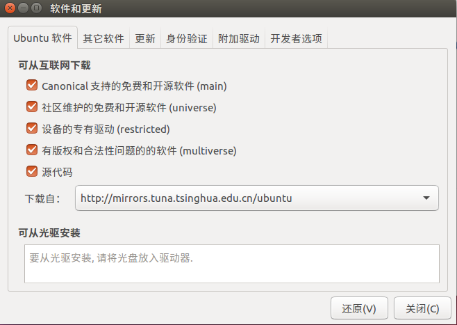
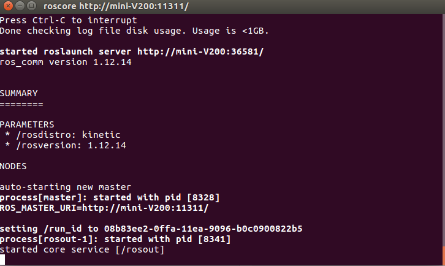
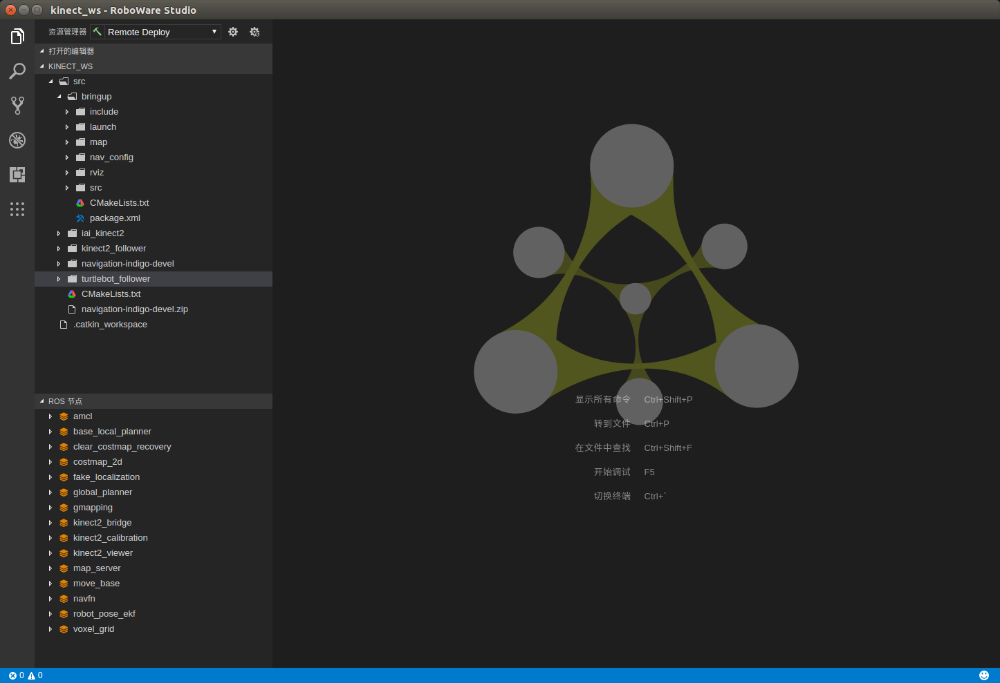

# 2 基础环境的配置与搭建

本章将介绍如何在Ubuntu 16.04 下安装ROS Kinetic Kame和相关工具。

为了避免各种玄学问题，在此强烈建议使用一台安装了Ubuntu操作系统的计算机，而不是使用虚拟机运行Ubuntu。如果你刚好有一台纯Ubuntu的电脑，那就最好了，如果没有，你可以安装双系统进行操作，附录中将简单介绍如何在Windows10下安装Ubuntu双系统。

## 2.1 ROS安装

关于ROS的安装，官网以及论坛上资源都比较多了，但也有些资源不太详细，在此稍微罗列一下在国内使用镜像源来完成ROS的安装。

### 2.1.1 配置软件源

由于Ubuntu初始软件源是国外的，在国内使用较慢，为了下载软件快一些，可以更换国内软件源。例如，在这里我们在设置（Settings）中点击软件与更新（Software\&Updates),将软件源换成清华的源，当然你也可以使用更加适合你的网络的源。

<div align=center>

</div>

<center>图2.1 更换软件源
</center>

修改完成后，在终端输入`sudo apt-get update && sudo apt-get upgrade `进行软件更新。

### 2.1.2 安装ROS桌面完整版

为了方便，我们将安装ROS的桌面完整版，它包含了rqt，rviz，机器人通用库等许多工具。当然你也可以安装基础的，之后自行安装需要的工具。可以在官网[^1]中查看安装步骤，或者跟着以下步骤。

[^1]: [http://wiki.ros.org/kinetic/Installation/Ubuntu](http://wiki.ros.org/kinetic/Installation/Ubuntu)

1. 添加代码列表sources.list，设置电脑可以从packages.ros.org接收软件，使用来自中国的源。
```shell
$ sudo sh −c '. /etc/lsb−release && echo "deb http://mirrors.ustc.edu.cn/ros/ubuntu/ $DISTRIB_CODENAME main" > /etc/apt/sources.list.d/ros−latest.list'
```

2. 添加公钥keys，为了能从ROS存储库下载功能包。
```shell
$ sudo apt-key adv --keyserver 'hkp://keyserver.ubuntu.com:80' --recv-key C1CF6E31E6BADE8868B172B4F42ED6FBAB17C654
```

3. 更新软件包索引，确保软件包索引是最新的。
```shell
$ sudo apt-get update && sudo apt-get upgrade
```

4. 安装ROS Kinetic 桌面完整版 约2.5G，包含ROS、rqt、rviz、机器人通用库、2D/3D 模拟器、导航以及2D/3D感知。
```shell
$ sudo apt-get install ros-kinetic-desktop-full
```
5. 漫长的等待……

6. 初始化rosdep，rosdep可以方便在你需要编译某些源码的时候为其安装一些系统依赖，同时也是某些ROS核心功能组件所必需用到的工具。
```shell
$ sudo rosdep init
$ rosdep update
```

7. 安装工具构建功能包依赖项，安装ROS的各种功能包的程序
```shell
$ sudo apt install python-rosinstall python-rosinstall-generator python-wstool build-essential
```

8. 环境变量配置，方便后续操作。
```shell
$ echo "source /opt/ros/kinetic/setup.bash" >> ~/.bashrc
$ source ~/.bashrc
```

### 2.1.3 测试安装结果

安装完成以后，可以打开新的终端，输入`roscore`运行主节点来测试是否安装正确。如出现以下界面，说明安装成功。

<div align=center>

</div>

<center>图2.2 运行roscore
</center>

## 2.2 集成开发环境安装

集成开发环境（IDE，Integrated Development Environment）是用于提供程序开发环境的应用程序，一般包括代码编辑器、编译器、调试器和图形用户界面等工具。集成了代码编写功能、分析功能、编译功能、调试功能等一体化的开发软件服务套。

由于ROS中许多类型名称很长，很难记，为了提高开发效率，推荐使用一款IDE来辅助开发。像万能的Eclipse，“最好的编辑器”VSCode，大神级别的Vim和Emacs等都可以用于ROS开发，你可以参考[http://wiki.ros.org/IDEs](http://wiki.ros.org/IDEs)来配置你的IDE。

本书将使用**Roboware-studio**进行开发。这款IDE基于VSCode编写，专门用于ROS开发，还可以自动更新依赖，较为方便，而且还是国产的，既然可以使用中文的，何乐而不为呢。虽然它已经很久没有更新了（截止2019年11月25日，最新的版本为2018年6月发布的1.2.0），甚至官网都打不开了，但你依然可以从[https://github.com/TonyRobotics/RoboWare/tree/master/Studio](https://github.com/TonyRobotics/RoboWare/tree/master/Studio)上下载软件安装包以及使用手册。

下载完成后，在软件包目录下打开终端，输入以下命令即可安装。

```shell
$ dpkg -i <package.deb> # 换成你的软件包
```

**注意：** roboware-studio 1.2.0的amd64和i386版本分别是64位和32位版本，请根据你的计算机进行选择。目前，该软件暂不支持arm架构，估计以后也不会支持了……

完成安装后就可以在终端输入`roboware-studio`来打开IDE。

<div align=center>

</div>

<center>图2.3 roboware-studio
</center>