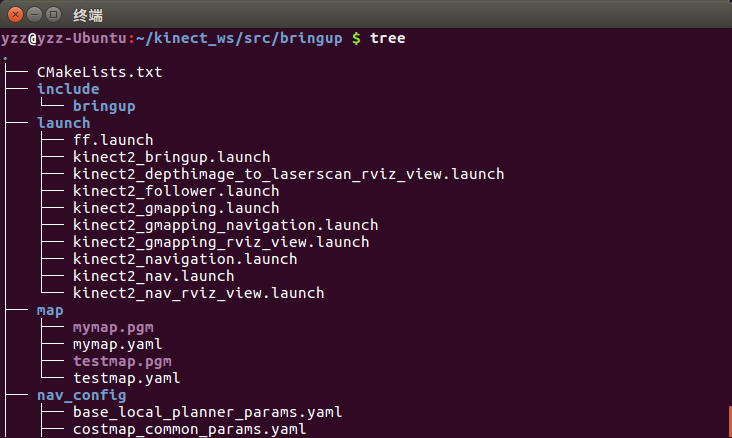

# 3 Linux基础

我们使用Ubuntu来运行ROS，所以需要对Linux的操作有一些了解，相关知识涉及很多，本章仅介绍部分会用到的Linux基础指令，并会对ROS基础中的基础知识进行介绍。

## 3.1 一段短小的介绍

与Windows、Mac OS一样，Linux是一款**<font color=blue >操作系统</font>**，它免费、开源、高效而稳定。尽管很多非专业人士可能根本不知道它，但它无处不在，从手机、智能家居、汽车到服务器、超级计算机，它可以算地球上最流行的平台之一了。

Linux最初由芬兰人林纳斯·托瓦兹（Linus Torvalds）在1991年编写，刚编写完的Linux 0.02内核只是可以驱动386所有的硬件并且读取Minix的文件系统而已。但通过托瓦兹和虚拟团队的努力，Linux内核加入了太多的功能，并在1994年推出了1.0正式版。在这股开源力量的加持下，通过数十年的发展，2019年Linux已经进入了5.0时代。关于Linux相关的历史，Unix、GNU计划和自由软件等等，真是可以写一本小书了，在此就不加赘述了，感兴趣的不妨自行上网了解。通过了解，你就会感叹于那真是一段天才辈出的“历史时期”。

Linux其实就是一个操作系统最底层的内核及其提供的内核工具。你可以在[https://www.kernel.org/](https://www.kernel.org/) 下载各种版本的Linux内核。Linux仅具有内核和内核所提供的工具，普通大众很难直接玩Linux。为了让用户能够接触Linux，许多商业公司或者团体，将Linux内核与可运行的软件整合起来，加上自己的工具程序，推出了"**内核+软件+工具+可完全安装程序**"的<font color=blue >Linux发行版</font>。我们将要使用的Ubuntu就是Linux众多发行版当中的一个。

Ubuntu[ʊ\rq bʊntuː] 这个名称来自非洲南部祖鲁语或豪萨语，是非洲传统的一种价值观，代表着社团关爱精神（生活在集体中，大家必须分享物品并互相关心），“我的存在是因为大家的存在”，而这也是Ubuntu Linux所坚持的精神。Ubuntu由南非人Mark Shuttleworth创办，基于Debian Linux（也是Linux的一个发行版），是一款以桌面应用为主的操作系统。每6个月会推出一个新版本，而我们将使用的Ubuntu 16.04 LTS是2016年4月推出的长期支持版本（Long Term Support），会支持到2021年（也快了……）

以上就是对Linux与Ubuntu的一个非常短小的介绍了，当然还是建议你去了解一下相关历史背景，如果你对这些渊源可以娓娓道来的话，有助于你对Linux有一个宏观的了解，以及装逼……

## 3.2 从终端开始

终端(Terminal)可以算是我们的主战场了，不管是Linux指令还是ROS的指令，我们都是在终端里输入。Linux的终端是控制台，是用户与内核交互的平台，通过输入指令来控制内核完成任务操作。终端也可以叫终端仿真器，它是一个程序，用于我们与shell交互。在介绍shell之前，我们不妨先打开终端，这里介绍几种常见的打开终端的方法：

- 使用`Ctrl+alt+T`快捷键打开终端
- 在文件夹或桌面单击鼠标右键，以当前路径打开终端
- 在终端中输入`gnome-terminal`打开一个新终端，新的终端与当前终端的目录一致

### 3.2.1 Linux终端技巧

打开的终端是不是有点像Windows下的命令行程序cmd？

| 快捷键             | 功能          | 备注                     |
| ------------------ | ------------- | ------------------------ |
| `Tab`              | 自动补全      | 单击补全，双击显示当前文件夹下文件                         |
| `Ctrl + c`         | 终止进程/命令 | 不是粘贴                         |
| `Shift + Ctrl + c` | 复制          | 注意和上面终止命令的区别 |
| `Shift + Ctrl + v` | 粘贴          |                          |
| `Ctrl + l`         | 清屏          | 相当于`clear`              |
| $\uparrow$         | 上一条命令    |                          |
| $\downarrow$       | 下一条命令    | 前提是你有下一条命令     |

### 3.2.2 什么是shell

简单点理解，就是系统跟计算机硬件交互时使用的中间介质，它只是系统的一个工具。实际上，在shell和计算机硬件之间还有一层东西那就是系统内核了。打个比方，如果把计算机硬件比作一个人的躯体，而系统内核则是人的大脑，至于shell，把它比作人的五官似乎更加贴切些。回到计算机上来，用户直接面对的不是计算机硬件而是shell，用户把指令告诉shell，然后shell再传输给系统内核，接着内核再去支配计算机硬件去执行各种操作。简而言之，shell是一个命令行解释器，用户通过shell向Linux发送请求，来运行程序，设置环境变量等。Linux系统（由内到外）：

<center>**外层应用程序->shell解释器->内核->硬件**</center>  
Ubuntu系统默认安装的shell叫做bash(Bourne Again Shell)，它是sh（Bourne Shell）的增强版本。Bourn Shell 是最早行起来的一个shell，创始人叫Steven Bourne，为了纪念他所以叫做Bourn Shell，检称sh。

## 3.3 文件与目录

Linux博大精深，可以用于大数据、程序设计、服务器管理等各种场合，各种场合又有不同的侧重方面，在这里我们只会介绍一下在ROS使用中你可能会用到的一些指令，这只是Linux的一些皮毛，但对于本书的开发应当还是够用了，毕竟作者也没能力进行Linux内核的讲解……

### 3.3.1 FHS与目录树

多数Linux系统采用**文件系统层次化标准**（Filesystem Hierarchy Standard， FHS）[^1]。FHS的主要目的是希望让用户可以了解已安装软件通常放置在哪个目录下。FHS主要针对目录树架构定义出以下三层目录应该放置什么数据：
[^1]: http://www.pathname.com/fhs/pub/fhs-2.3.html

- `/` (root，根目录)：其内容必须足以引导(boot)、还原(restore)、恢复(recover)和/或修复(repair)系统。所以此目录主要与系统相关。
- `/usr` (unix software resource)：此为文件系统的第二个主要部分，是可共享的只读数据。它主要和软件安装与执行相关。
- `/var` (variable)：包含变量数据文件(variable data files)，例如缓存(cache)，日志(log file)等。它与程序运行过程有关。

什么又是**目录树**(directory tree)呢？在Linux下，所有的文件与目录都是从<font color=green>**根目录**</font>开始，再在此目录的基础上创建各个目录，如图3.1所示，就像一棵树一样，所以称为“目录树”。

<div align=center>

</div>
<center>图3.1 目录树</center>
每个“树枝”上文件夹都有其规定，例如`bin`下存放着最经常使用的命令，`/home`是普通用户的家目录，一般的用户账号都会放在这里，`/opt`是给第三方辅助软件放置的目录，ROS就是安装在这个文件夹下……其余文件的作用可以在网上自己查询，在此就不赘述了。

为了更加形象地说明目录树，我们可以在终端中输入`sudo apt-get install tree`来安装tree，安装完成以后输入`tree`，来查看当前目录下的目录树。

<div align=center>

</div>
<center>图3.2 查看目录树</center>
通过以上介绍，想必你对Linux的文件系统有了最初的了解，需要注意的是，Linux各个目录存放的内容是规划好的，*不要随意放文件*，Linux是以文件的形式管理我们的设备的，如果对当前文件目录有所困惑，不妨用一下tree指令。

### 3.3.2 文件与目录指令

现在，我们来开始指令的介绍，首先是常见的处理目录的指令。让我们在Ubuntu桌面使用`Ctrl+alt+T`打开终端开始吧~

**注意：** 命令与`[选项]`与`[目标]`之间都有空格，以及`[ ]`内的东西可以没有。如果不知道`[选项]`里填什么，可以搜索，或者输入命令 `--help`查询，例如查询rm的选项 `rm --help`。

- ls: 列出目录，显示当前目录下的文件与文件夹。如果你想查看修改时间这些更详细的信息，可以使用ll命令。
```shell
$ ls [选项] [目录或文件]
```

- cd: 切换目录(change directory)，用于切换工作目录的指令，例如cd ..回到上一级目录，cd 回到家目录。
```shell
$ cd [相对路径或绝对路径]
$ cd /root # 切换到root目录
```

- pwd: 显示当前目录(print working directory)，其显示的是当前目录的绝对路径。
```shell
$ cd [相对路径或绝对路径]
$ cd /root # 切换到root目录
```

- mkdir: 创建目录(make directory)
```shell
$ mkdir [选项] 创建的目录名
$ mkdir /catkin_ws/src # 在catkin_ws下创建src目录
```

- rm: 移除文件或目录(remove)，如果要删除的目录非空，可以使用rm -rf 删除。
```shell
$ rm [选项] [要删除的目录]
$ rm hello.cpp # 删除hello.cpp文件
```

- cp: 复制文件或目录(copy)到指定目录。
```shell
$ cp [选项] 指定目录
$ cp hello.txt src/  # 将hello.txt拷贝到 src/
```

- echo: 输出内容到控制台。
```shell
$ echo [选项] [输出内容]
$ echo $PATH # 输出环境变量
```

- mv: 移动文件或重命名。
```shell
$ mv yesterday today # 将yesterday文件改名为today
$ mv /bread /stomach # 将/bread文件移动到/stomach中
```

- \>: 输出重定向，会将原来的文件的内容覆盖。
```shell
$ ls -l > detail.txt # 将列表的内容覆盖写入detal.txt中
```

- \>>: 追加，不覆盖原来的内容，而是追加到文件的尾部。
```shell
$ ls -l > > detail.txt # 将列表的内容写入detal.txt尾部
```

关于文件与目录相关的指令就介绍这么多，这些也是使用ROS过程中经常使用的命令，如果需要了解更多命令，可以在网上查找，如果想了解指令的细节，可以通过`--help`进行查看。

## 3.4 软件管理

### 3.4.1 解压缩

- gzip: 压缩后的格式为.gz，这种压缩方式不能保存原文件，且不能压缩目录。
```shell
$ gzip buodo # 压缩
$ gunzip buodo.gz  # 解压
```

- tar: 可以以多种形式压缩文件
```shell
# 压缩
$ tar -zvcf buodo.tar.gz buodo 
$ tar -jvcf buodo.tar.bz2 buodo  
# 解压
$ tar -zvxf buodo.tar.gz 
$ tar -jvxf buodo.tar.bz2
```

- zip: 可以压缩目录，可以保留原文件.
```shell
# #压缩和解压文件
$ zip boduo.zip boduo
$ unzip boduo.zip
# 缩和解压目录
$ zip -r Demo.zip Demo
```

### 3.4.2 软件包管理

大多数流行的 Linux 发行版在包管理工具、方式和形式都大同小异，但却还是有平台差异。

| 系统          | 格式 | 工具                          |
| ------------- | ---- | ----------------------------- |
| Debian/Ubuntu | .deb | apt, apt-get, apt-cache, dpkg |
| CentOS        | .rpm | yum                           |
| Fedora        | .rpm | dnf                           |

Debian 及其衍生产品（如Ubuntu）的包格式为.deb文件。APT 是最常见包操作命令，而要直接安装现成.deb包时需要使用dpkg (Debian package的缩写)命令。

CentOS、Fedora 及 Red Hat系列 Linux 使用RPM(全称为 Redhat Package Manager)包文件，并使用yum命令管理包文件及与软件库交互。

在 GNU/Linux( 以下简称 Linux) 操作系统中，RPM 和 DPKG 为最常见的两类软件包管理工具，在这里主要介绍基于DEB软件包的管理工具——DPKG。

### 3.4.3 软件包操作
- 更新本地包数据库：  大多数 Linux 都使用本地数据库来存储远程可用的包仓库列表，所以在安装或升级包之前最好更新一下这个数据库。
```shell
$ sudo apt-get update
```

- 查找/搜索软件包：大多数 Linux 桌面版本都提供用户可搜索和安装软包的界面，对于普通用户来说，这是找寻和安装软件的最佳方法。但对于追求效率和服务器管理员来说，使用命令行工具查找/搜索软件包更加方便。
```shell
$ apt-cache search 搜索内容
```

- 从软件仓库安装包：  一旦我们知道某个软件包的名称之后，便可以使用如下命令从软件仓库安装包。
```shell
$ sudo apt-get install 包名
```

- 从本地文件系统中安装包：当我们从某个地方直接拿到软件包时，需要从本地文件系统直接安装包。Debian 及衍生系统可以使用 dpkg 进行安装，CentOS 和 Fedora 系统使用 yum 和 dnf 命令进行安装。
```shell
$ sudo dpkg -i 包名.deb  
```

- 移除已安装的包：卸载不需要的软件包之后通常可以获得一个干净的系统。
```shell
$ sudo apt-get remove 包名  
```


