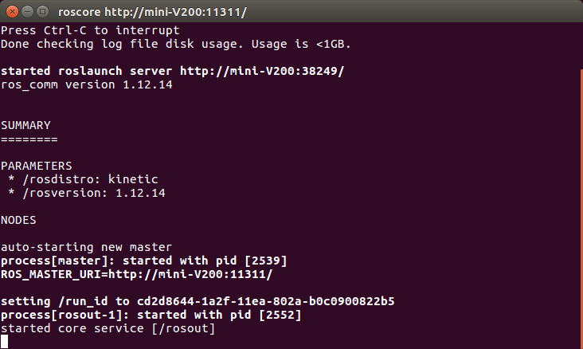
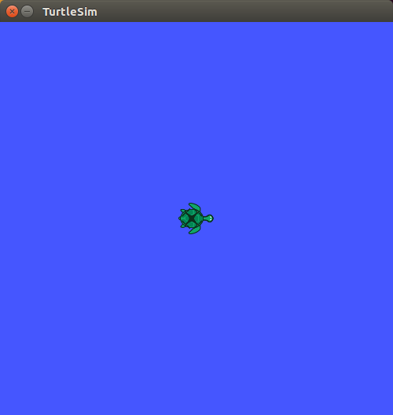
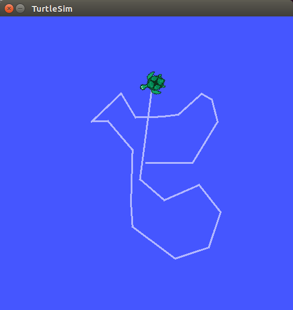
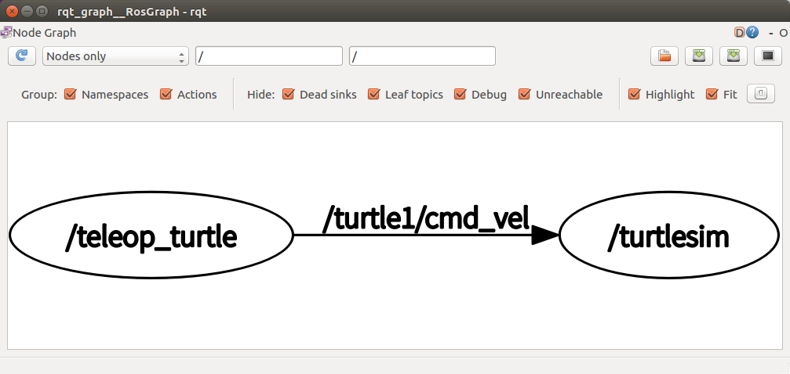
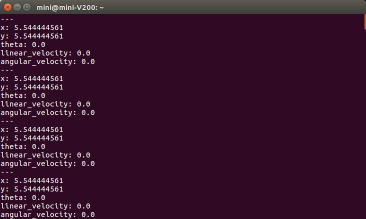
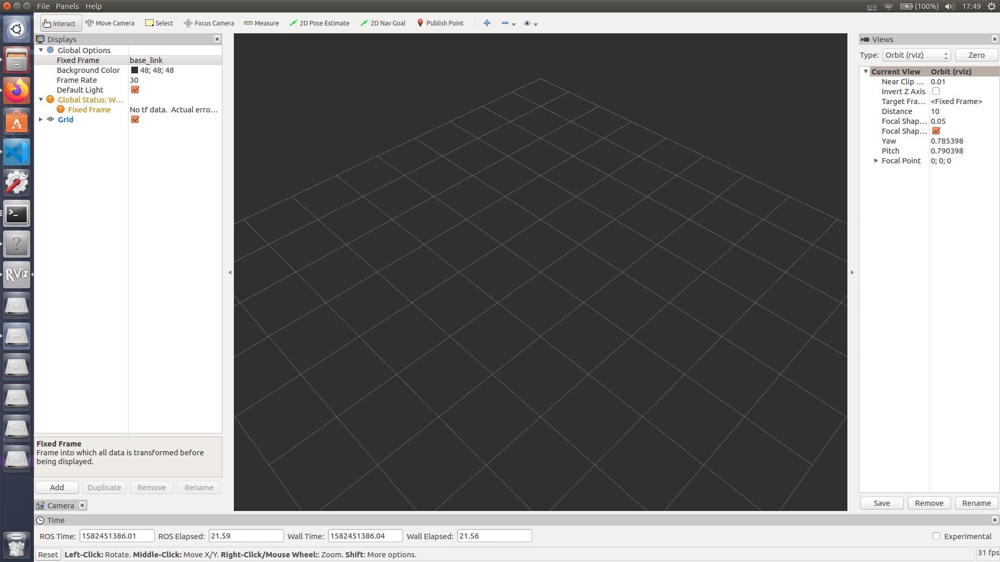
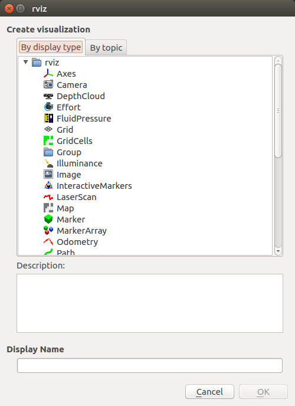
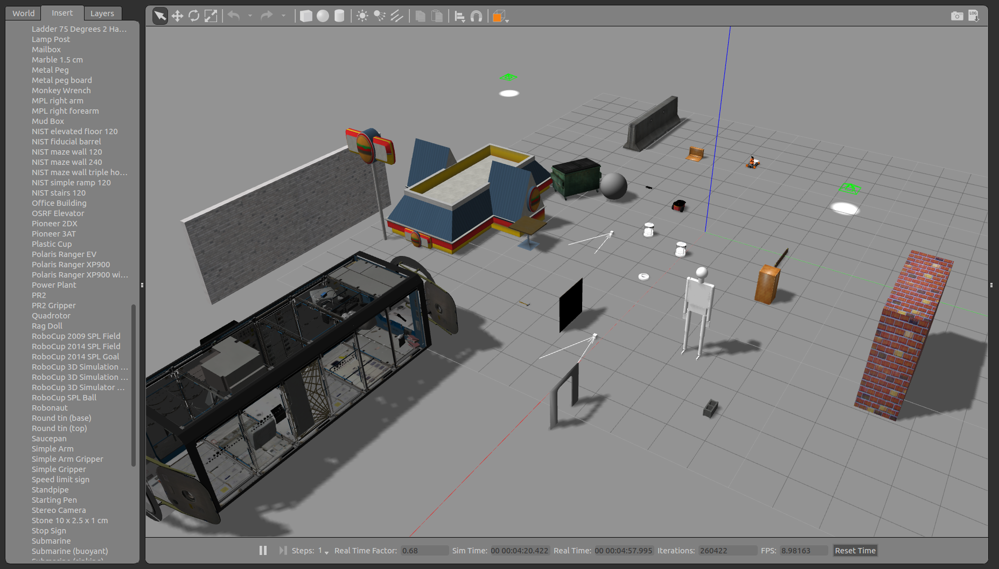

# 4 ROS基础

我们终于来到了ROS的学习，在本章，我们将首先完成一个小乌龟的案例，然后通过这个小乌龟来学习ROS的一些基础概念与基础命令，之后还会介绍几个使用十分频繁的工具。

## 4.1 进击的小乌龟

相信通过之前的章节，你已经安装好了ROS，我们可以通过运行以下指令来测试一下。

```shell
$ roscore
```

<div align=center>

</div>
<center>图4.1 启动主节点
</center>

如果成功启动了主节点，那么你就可以继续进行了；如果没有，很遗憾，请再回到第二章，检查检查安装过程吧。

### 4.1.1 让小乌龟动起来

打开一个新的终端，运行以下命令，我们将执行turtlesim功能包的`turtlesim_node`节点，可以在一个新的窗口看见一只小乌龟。这时，乌龟并不会动的，我们需要再运行一个节点才能让它动起来。

```shell
$ rosrun turtlesim turtlesim_node
```

再打开一个终端，输入以下指令，将执行turtlesim包的`turtle_teleop_key`，你可以使用`Tab`进行补全。运行成功后，你就可以在该终端中按下方向键来控制小乌龟移动了。

```shell
$ rosrun turtlesim turtle_teleop_key
```

<center class="half">    
      
</center>
<center>图4.2 静止的乌龟与进击的乌龟</center>
**注意：** 一定是在运行`turtle_teleop_key`的终端里来进行控制，可以通过鼠标点击此终端窗口，确保在该终端。

### 4.1.2 查看节点关系

我们将使用这只可以移动的乌龟来初识节点之间的联系。在新的终端中输入以下命令，可以启动rqt\_graph功能包的`rqt_graph`节点，并显示正在运行的节点信息。

```shell
$ rqt_graph
```

<div align=center>

</div>
<center>图4.3 小乌龟的节点
</center>

rqt\_graph提供了一个可视ROS计算图的GUI插件，我们将在后面小节详细介绍。图4.3的大致意思就是，`turtlesim_node`节点和`turtle_teleop_key`节点通过一个名为`/turtle1/command_velocity`的话题来进行通信，并且`/turtle1/command_velocity`是/turtle1话题的子话题。<font color=blue>圆圈</font>代表了节点，节点之间<font color=blue>连接线上的字</font>代表话题。通过箭头的指向，可以知道`/teleop_turtle`节点通过键盘输入的速度命令通过话题将消息发送给`turtlesim`，从而控制它移动。

对小乌龟的整个运行流程有了宏观的了解后，我们再来直观感受一下。输入以下命令，列出正在运行中的所有节点。可见终端列出了用于在roscore进行日志记录的rosout节点[^1]，还有我们和乌龟有关的teleop_turtle和turtlesim 节点。
[^1]:  [http://wiki.ros.org/rosout](http://wiki.ros.org/rosout)
```shell
$ rosnode list
/rosout
/teleop_turtle
/turtlesim
```

节点看完了以后，我们来看下小乌龟的话题。输入以下命令列出所有获得动话题列表。如果你使用`rostopic list -v`，还可以将话题分为发布话题和订阅话题，并将每个话题的消息类型一起显示。

```shell
$ rostopic list
/rosout
/rosout_agg
/turtle1/cmd_vel
/turtle1/color_sensor
/turtle1/pose
```

如果你想查看某个话题的信息，例如查看/turtle1/pose的信息，可以输入以下命令，echo是不是很眼熟呢，这在Linux章节中有过介绍，不记得可以回到前面回顾一下。

```sh
$ rostopic echo /turtle1/pose
```

<div align=center>

</div>
<center>图4.4 /turtle/pose话题的信息</center>

这时终端就可以实时显示`/turtle1/pose`话题的信息了，可以发现话题中包含了x、y、theta、linear_velocity以及angular_velocity的数据。我们不妨点击我们运行`teleop_turtle`的那个窗口，然后按下方向键，观察一下`/turtle1/pose`的变化。如果你的小乌龟动起来了的话，可以看见，pose信息是在不断变换的。你可以再使用`rostopic echo`指令查看一下cmd_vel话题，然后移动小乌龟看它怎么变化的。

### 4.1.3 从进击的乌龟所得

这样你就完成了你的第一个ROS实例，虽然挺简单，但是却蕴含了丰富的内容。我们不妨把小乌龟想象成一个实体机器人，你使用键盘控制一个实体机器人移动的逻辑其实和控制小乌龟是类似的，通过某个节点发送某个话题，从而控制某个节点，这个节点则控制了机器人移动。如果你的机器人没有动，你可以通过`rosnode list`和`rostopic list`查看是否有应该出现的节点/话题结果没有出现，然后判断程序可能在哪里出了问题，是订阅的节点名称写错了还是其他什么问题。如果你想了解机器人运动时的具体情况，可以通过`rostopic echo`查看具体话题的信息。

这些思想和方法在后面的开发以及调试中很有用，希望你可以从这只小小的乌龟中学到，然后用于你自己的“变形金刚”里。

## 4.2 ROS的一些概念

通过上一节的练习，也许你对于的节点、话题这些概念已经有了一些模糊的了解，接下来我们来具体介绍这些概念。ROS的基本概念分为三个层面[^1]：
[^1]: [http://wiki.ros.org/ROS/Concepts](http://wiki.ros.org/ROS/Concepts)

- 文件系统层(Filesystem Level)：包括功能包、元功能包、功能包清单等在在硬盘上会看到的ROS资源；
- 计算图层(Computation Graph Level)：包括节点、主节点、话题、服务、消息等，它们以不同的方式向计算图提供数据，而计算图则是用来处理ROS进程的点对点网络；
- 社区层(Community Level)：包括ROS发行版、Wiki、代码仓库等，可以从这些地方获得支持。

ROS中的很多术语，初次接触可能并不是很好理解，本书作为一本侧重实验类的指导书，只会讲解我们后续可能会接触到的部分，其余的可以自行看参考资料或者Wiki上查询。

### 4.2.1 ROS术语
**主节点** [^2]  

[^2]: [http://wiki.ros.org/Master](http://wiki.ros.org/Master)

主节点(master)，也叫节点管理器，通常使用`roscore`运行，负责节点到节点的连接和消息通信，它注册了每个节点的名字，让各个节点可以彼此定位，从而进行通信，如果没有它的话，节点之间就无法进行交流。**ROS中只允许存在一个Master**。不妨在小乌龟例程中，终端`roscore`终端的运行，可以看看会发生什么。

**节点**[^3]  

[^3]: [http://wiki.ros.org/Nodes](http://wiki.ros.org/Nodes)

节点(node)是执行任务的进程，可以看作是一个可执行程序。例如，小乌龟中，运行乌龟的`turtlesim`就是一个节点，进行键盘控制的`teleop_turtle`也是一个节点。一个系统一般由多个节点组成，例如机器人中，一个节点控制深度传感器，一个节点控制电机，一个节点执行定位，一个节点进行路劲规划……这一个个单一功能的节点组合起来，就成为了一个复杂的系统。你可以使用`rqt_graph`查看各个节点之间的关系。

节点运行的同时，向主节点注册节点的名称，并且注册发布者(publisher)、订阅者(subscriber)、服务服务器

**消息**[^4]  

[^4]: [http://wiki.ros.org/Messages](http://wiki.ros.org/Messages)

消息(message)是一种简单的数据结构，例如常见的整型、浮点型、布尔型变量，以及用户自定义的简单数据结构。节点之间就是通过消息来发送和接收数据的。节点之间的消息通信方式分为三种：话题、服务和动作，不同的通信方式又有不同的消息文件

| 方式 | 区别     | 消息文件 |  说明                                          |
| ---- | -------- | -------- | ------------------------------------------ |
| 话题 | 异步单向 | msg      | 单向发送/接收信息                          |
| 服务 | 同步双向 | srv      | 双向消息请求/响应                          |
| 动作 | 异步双向 | action   | 双向消息目标/结果/反馈方式，需要中途反馈值 |

我们主要说明话题这种方式，其余两种可以查看参考资料4.2节。

**话题**[^5]

[^5]: [http://wiki.ros.org/Topics](http://wiki.ros.org/Topics)

话题(topic)中，节点分为发布者(publisher)和订阅者(subscriber)，回看小乌龟例程中图4.3，键盘控制节点`/telop_turtle`是publisher，而`/turtlesim`则是subscriber，`/turtle1/cmd_vel`就是一个话题。发布者在主节点上注册了自己的话题等信息，订阅者节点也在主节点上注册自己希望接收的话题等信息。主节点像个“媒人”一般，让订阅者节点直接与发布者节点联系，接收其消息。这是一种异步的通信方式，常用于发送和接收联系消息，例如连续发送消息的传感器。虽然主节点充当“媒人”的功能，但发布者和订阅者却不能比作男方和女方，因为一个节点可以成为多个发布者，同时也可以成为多个订阅者，这当然是不符合“一夫一妻”制的……

### 4.2.3 ROS文件系统

和Linux一样，我们也会介绍ROS的文件系统。在此之前，先创建一个工作区间。在根目录下创建一个名为`learning_ws`的文件夹，并初始化为工作空间：

```shell
$ mkdir -p ~/learning_ws/src
$ cd ~/learning_ws/src/
$ catkin_init_workspace
```

创建完成后，编译整个工作空间：

```shell
$ cd ~/learning_ws/
$ catkin_make
```

编译完成后，`learning_ws`文件夹下会生成`build`和`devel`两个文件夹。ROS的工作空间主要有四个目录：

- `src`: 代码空间，用来存储ROS功能包的源代码。所以，一个工作空间中可以有很多功能包，不用每次写程序都创建一个新空间。
- `build`: 编译空间，用来存储空间编译过程中产生的缓存信息和中间文件。
- `devel`: 开发空间，用来防止边用生成的可执行文件。
- `install`: 安装空间，非必须的，可以在编译完成后使用`make insall`来蒋可执行未见安装到该空间。

编译完成后，可以运行`devel`文件夹下的`setup.bash`脚本来设置环境变量，但是这个环境变量只在**当前终端**生效，可以将其加入`.bashrc`文件，来让其在所有终端生效，就像我们在安装ROS时做的那样。

```shell
$ source devel/setup.bash # 当前环境生效
$ echo "source ~/learning_ws/devel/setup.bash" >> ~/.bashrc # 所有终端生效
```

接下来，我们创建一个名为`test_pkg`的功能包，其依赖项是`roscpp`：

```shell
$ cd ~/learing_ws/src/
# catkin_create_pkg [功能包名称] [依赖功能包1] [依赖功能包n]
$ catkin_create_pkg test_pkg roscpp
```

创建完成后，我们查看功能包的结构。使用`ls`来查看`test_pkg`目录下的文件，其中包括了：

- include: 存放头文件。
- src: 源代码文件夹，和工作空间一样，此处也有src文件夹，但工作空间中的src里面放的是功能包，功能包的src里面放的是cpp文件这些“源码”。
- CMakeLists.txt: 构建配置文件，记录了功能包的编译规则。
- package.xml: 功能包配置文件，描述了功能包属性的信息。

**注意：** 同一个工作空间，不能有两个相同名称的功能包；功能包里面不能再创建另一个功能包。

除了这几个创建完以后自动生成的文件和文件夹，功能包里面还可以手动创建相关文件夹，例如：

- launch: 用于roslaunch的启动文件
- msg: 存放消息文件
- src: 存放服务文件

## 4.3 ROS的一些命令

在这里我们介绍一些ROS常用的命令。

ROS默认使用的构建系统是CMake，所以功能系统在功能包中的描述就叫CMakeList.txt。实际上，CMake被修改为更适合ROS的catkin系统，所以我们首先就来介绍catkin的一些指令。

### 4.3.1 catkin命令

`catkin_init_workspace`: 初始化工作空间，一般在工作空间下的src文件夹中使用。例如前面文件组织中所用的：

```shell
$ cd ~/learning_ws/src
$ catkin_init_workspace
```

`catkin_create_pkg`: 生成功能包。在工作空间下的src文件夹使用，创建一个空的功能包，依赖的功能包之间用空格分开。

```shell
$ cd ~/learning_ws/src
$ catkin_create_pkg [功能包名称] [依赖功能包1] [依赖功能包n]
```

`catkin_make`: 使用catkin系统编译，在工作空间中使用。运行修改的文件之前需要编译，这是常识……

```shell
$ cd ~/learning_ws
$ catkin_make 					# 编译整个空间
$ catkin_make --pkg test_pkg 	#只编译test_pkg这个功能包
```

### 4.3.2 执行命令

`roscore`: 运行主节点，关于主节点的介绍请参考4.2.1节。

`rosrun`: 运行单个节点，需要指明功能包名称和节点名称。例如小乌龟中的例子。

```shell
$ rosrun [功能包名称] [节点名称]
$ rosrun turtlesim turtlesim_node
$ rosrun turtlesim turtle_teleop_key
```

`roslaunch`: 运行launch文件，启动多个节点。当然，一个系统不可能一个一个节点地启动，这时就需要使用launch文件。在这里我们在`test_pkg`中创建一个文件夹存放launch文件，然后写一个launch用于一次性启动小乌龟节点和键盘控制节点。

```shell
$ cd ~/learning_ws/src/test_pkg
$ mkdir -p launch && cd launch/
$ gedit turtle_teleop.launch 	# 创建一个launch文件
```

launch文件采用XML形式，必须有一个根元素<launch>，启动节点时，需要指明节点功能包的名称`pkg`，功能包下可执行文件的名称`type`，以及定义一个名字`name`。这就是一个基本的launch文件了。当然，真正的launch文件会更复杂，包含许多参数，变量甚至嵌套其余的launch文件。

在`turtle_teleop.launch`将下列命令粘贴进去，保存后退出。

```xml
<launch>
    <node pkg="turtlesim" type="turtlesim_node" name="turtle"/>
    <node pkg="turtlesim" type="turtle_teleop_key" name="teleop_key"/>
</launch>
```

roslaunch同样需要指明功能包名称和launch文件名。运行刚才写的launch文件，就可以直接通过键盘控制乌龟的移动了。

```shell
$ cd ~/learning_ws
$ catkin_make
$ source devel/setup.bash # 在当前终端添加环境变量
# roslaunch [功能包名] [功能包下的launch文件]
$ roslaunch test_pkg turtle_teleop.launch 
```

实际上，如果仅仅修改launch文件，是不用重新编译的。但如果涉及到了功能包下的源文件，就一定需要重新编译。

### 4.3.3 bash命令

和Linux类似，ROS也有一些功能相似的bash命令[^6]。

[^6]: [http://wiki.ros.org/rosbash](http://wiki.ros.org/rosbash)

`roscd`: 使用它，可以跳转到指定的功能包中。例如

```shell
$ roscd test_pkg
```

`rosls`: 可以查看指定功能包的文件列表，当然你也可以先使用`roscd`进入该功能包，再`ls`查看文件。

```shell
$ rosls turtlesim
cmake  images  msg  package.xml  srv
```

### 4.3.4 信息命令

与ROS通信相关的命令，我们可以使用相关命令来查看节点、话题、消息、服务等信息。

**rostopic**: ROS话题相关的命令[^7]。

[^7]: [http://wiki.ros.org/rostopic](http://wiki.ros.org/rostopic)

| 命令                                      | 作用                     |
| ----------------------------------------- | ------------------------ |
| rostopic list                             | 显示活动的话题           |
| rostopic echo [话题名称]                  | 实时显示该话题的消息内容 |
| rostopic info [话题名称]                  | 显示该话题的信息         |
| rostopic pub [话题名称] [消息类型] [参数] | 使用指定话题名称发布消息 |

例如在4.1节中，我们启动了小乌龟，然后列出了它的话题，再选定一个话题，实时显示它的消息。

使用rostopic pub可以快速地发布消息，进行测试。例如我们运行小乌龟的例程，然后以10Hz的频率，指定`/turtle1/cmd_vel`发布`geometry_msgs/Twist `类型的消息，输入消息类型后，可以使用[Tab]补全参数，进行更改。

```shell
$ rosrun turtlesim turtlesim_node
```

打开另一个终端，让小乌龟在x方向以0.5m/s的速度移动，以z轴为中心，每秒选装0.5rad，你也可以更改参数，看看输入后会发生什么。

```shell
$ rostopic pub -r 10 /turtle1/cmd_vel geometry_msgs/Twist "linear:
x: 0.5
y: 0.0
z: 0.0
angular:
x: 0.0
y: 0.0
z: 0.5
"
```

后面几种命令与rostopic有相似之处,在此就不一一介绍了。

**rosnode**: ROS节点

| 命令                     | 作用           |
| ------------------------ | -------------- |
| rosnode list             | 显示活动的话题 |
| rostopic kill [节点名称] | 停止该节点     |
| rostopic info [话题名称] | 查看该节点信息 |

**rosmsg**: ROS消息信息

| 命令                         | 作用                       |
| ---------------------------- | -------------------------- |
| rosmsg list                  | 显示所有信息               |
| rostopic show [消息名称]     | 显示该消息                 |
| rostopic pakage [功能包名称] | 显示用于该功能包的所有消息 |

**rossrv**: ROS服务信息

| 命令                       | 作用                      |
| -------------------------- | ------------------------- |
| rossrvlist                 | 显示所有服务              |
| rossrv show [消息名称]     | 显示该服务信息            |
| rossrv pakage [功能包名称] | 显示用于该功能包的所有f㐏 |

更多的指令以及参数，可以在[http://wiki.ros.org/ros_comm](http://wiki.ros.org/ros_comm)查询。

## 4.4 ROS工具

为了方便用户使用，ROS提供了许多工具，本节主要介绍我们会用到的三种：rqt、RViz和Gazebo。

### 4.4.1 rqt

这是一个基于Qt的的ROS GUI工具箱，我们之前使用的rqt_graph便属于其中的一个。

**(1) rqt_graph**

输入`rqt_graph`启动，用于可视化ROS的计算图。

<div align=center>

</div>
<center>图4.5 rqt_graph界面
</center>

**(2) rqt_plot**

输入`rqt_plot`运行，用于绘制二维数值曲线。例如在小乌龟中，绘制x，y坐标变化。

<div align=center>

</div>
<center>图4.6 rqt_plot界面
</center>

**(3) rqt_reconfigure**

输入`rosrun rqt_reconfigure rqt_reconfigure`运行，动态配置系统中的参数，可以在界面中选择相关参数，进行配置。

<div align=center>

</div>
<center>图4.7 rqt_reconfigure界面
</center>

### 4.4.2 RViz

RViz是ROS的三维可视化平台，可以将数据可视化表达。例如，我们接下来要使用的深度摄像头，可以在RViz中显示深度图像，以及深度数据转换后的激光雷达点云数据。

我们使用的桌面完整版ROS已经安装好了RViz，如果没有安装可以使用下列命令安装：

```shell
$ sudo apt-get install ros-kinetic-rviz
```

在roscore运行的前提下，可以在新终端输入`rviz`运行。

<div align=center>

</div>
<center>图4.8 RViz界面
</center>

左侧为工具栏，可以点击左下角的`Add`添加显示数据的插件，其中包括用来显示摄像头图像的`Camera`，显示激光雷达数据的`Laser Scan`，显示机器人模型的`RobotModel`等，更多内置显示项及说明可见[http://wiki.ros.org/rviz/UserGuide](http://wiki.ros.org/rviz/UserGuide)。

<div align=center>

</div>
<center>图4.9 可视化选项
</center>

添加显示项后，可以在左侧工具栏进行配置，不同项的配置不同，需要结合具体实例。例如，Camera中，Topic选项里，选择不同的topic，就会出现不同的内容。

### 4.4.3 Gazebo

Gazebo是一个3D物理仿真平台，可以仿真机器人、传感器和各种不同的环境。你可以在仿真平台下模拟使用众多昂贵的，危险的机器人。下一章我们也首先会在Gazebo中仿真我们的TurtleBot 2。

我们使用的桌面完整版ROS已经安装好了Gazebo，如果没有安装可以使用下列命令安装：

```shell
$ sudo apt-get install ros-kinetic-gazebo
```

可以在新终端输入`gazebo`运行。你可以通过左侧的工具栏插入各种各样的模型，构建自己的世界。由于模型加载可能会出现一些问题，我们将在5.2节中说明。

<div align=center>

</div>
<center>图4.10 Gazebo界面
</center>