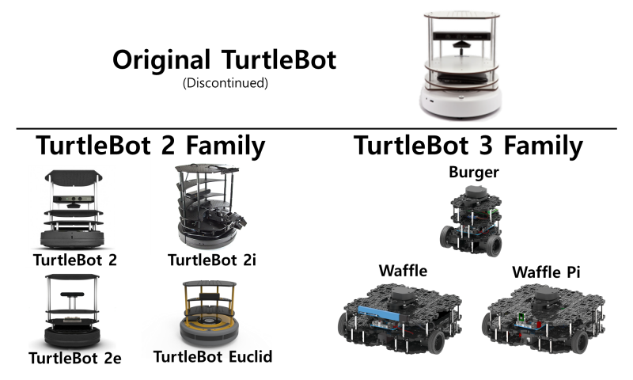
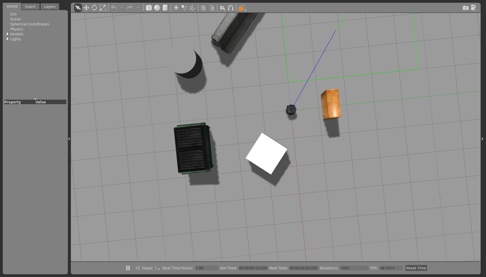
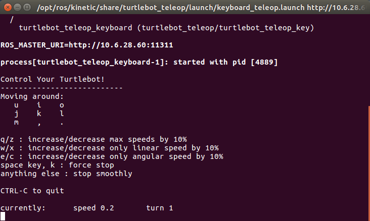
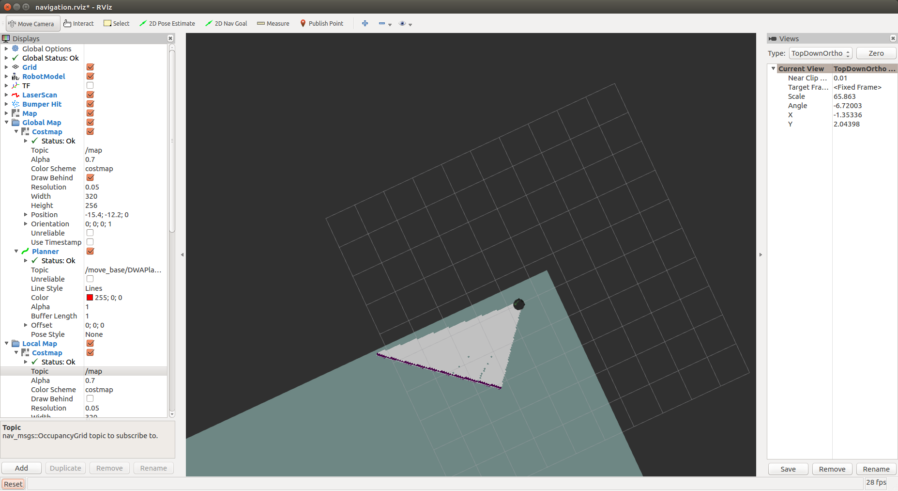
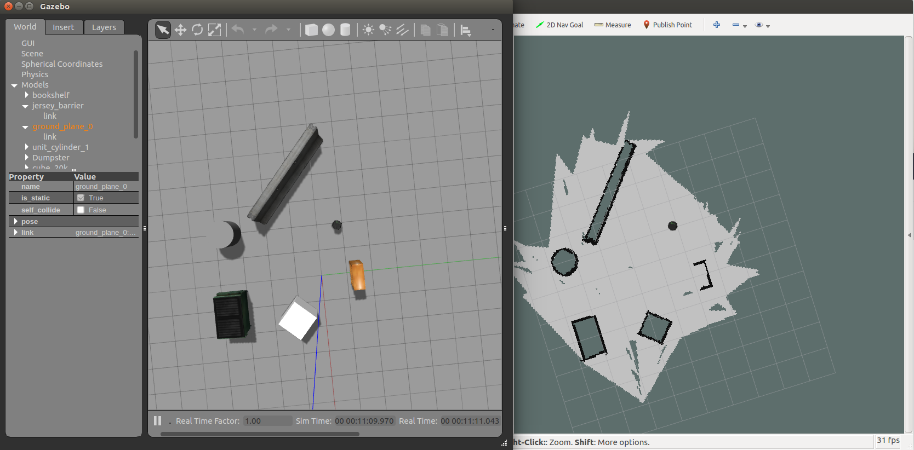
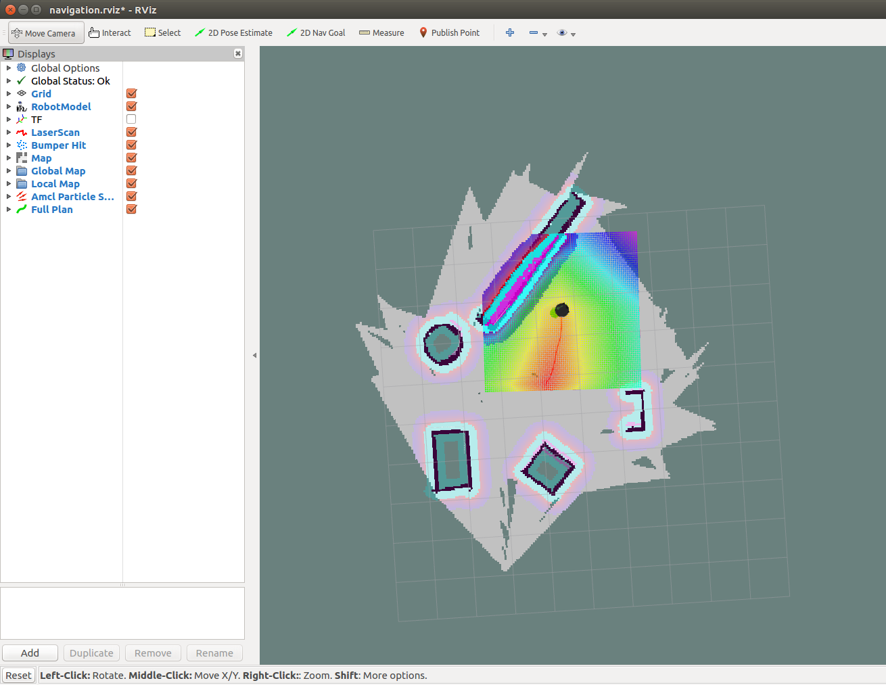

# 5 TurtleBot仿真

完成ROS里小乌龟的仿真以后，接下来我们需要来看一个真正的机器人——TurtleBot。在上手实物之前，我们需要先进行仿真，在仿真环境下先体验一下我们的任务。

本章将会介绍TurtleBot 2移动机器人平台，并讲解如何安装仿真所需要的工具，以及如何

- 在Gazebo下启动TurtleBot
- 用键盘移动机器人，建立地图
- 在所建地图下导航

虽然仿真与实际实验可能有较多不同之处，但总体的实现逻辑是相似的。而且养成先仿真的习惯也有助于今后的实验，毕竟使用的机器人可能价格不菲，未经验证直接上手实验很可能会造成巨大的损失。

## 5.1 TurtleBot简介

TurtleBot是一款低成本的个人机器人套件，并且带有开源软件。2010年11月，Melonee Wise和Tully Foote在Willow Garage创建了TurtleBot 1；2012年，Yunjin Robot公司开发了基于Kobuki底座的TurtleBot 2；2017年，更加开源且自由的TurtleBot 3推出了。图X展示了TurtleBot系列的机器人。本章以及之后章节将基于TurtleBot 2进行讲解，故这里主要对它进行介绍。

<div align=center>

</div>
<center>图1.1 Tuertlebot系列
</center>

TurtleBot 2是世界上最流行的低成本、开源机器人，用于许多学校与科研机构。它的主体硬件包括Kobuki底座，支架，深度摄像头和一台PC。当然你也可以根据自己的需求安装激光雷达，更换深度摄像头以及其他的硬件改装。整个TurtleBot 2组装好以后约为354 x 354 x 420 mm，重约6.3kg，最大载重5kg，最高速度0.65m/s。关于其他的参数细节以及模型图纸，可以在[https://www.turtlebot.com/build/](https://www.turtlebot.com/build/)下载。

## 5.2 TurtleBot 2安装

​    为了进行TurtleBot 2的仿真，需要安装相关功能包以及环境。如果你安装的ROS为桌面完整版的话，那么你只需安装相关功能包即可，否则你可能还需要安装Gazebo、RViz等环境。

首先我们安装TurtleBot相关的工具包。为了方便，我们直接使用*安装了所有的包。

```bash
$ sudo apt-get install ros-kinetic-turtlebot-*
```

安装完成以后我们就可以在Gazebo下启动TurtleBot了。

```bash
$ roslaunch turtlebot_gazebo turtlebot_world.launch
```

**注意**：如果你的Gazebo打开了却是黑屏，什么也没有，这说明model库加载不正确，因为gazebo加载时会从网上下载许多模型，而连接国外的网站常常较慢。你可以下载本教程所给资源中models.tar.gz，或者在终端输入`hg clone https://bitbucket.org/osrf/gazebo_models`命令，将模型下载出来。然后将文件解压，里面的模型放在一个文件夹下，取名为`models`，再将此文件夹复制到home目录下的.gazebo文件夹里（这是一个隐藏文件夹，可以在home目录下按ctrl+h显示）。

如果你成功启动了TurtleBot，那么你就可以看到以下画面。这就是Gazebo的世界。进行到这里，说明可以已经安装好了TurtleBot 2的仿真环境，那就进入Gazebo的世界吧。

<div align=center>

</div>
<center>图5.2 gazebo界面
</center>

##  5.3 移动TurtleBot

在成功打开Gazebo的基础上，打开一个新的终端，输入以下命令，运行一个键盘控制节点：

```bash
$ roslaunch turtlebot_teleop keyboard_teleop.launch
```

打开以后你就可以看见以下画面，依照终端的提示，就可以使用相关的按键来移动TurtleBot，以及改变线速度、角速度。

<div align=center>

</div>
<center>图5.3 启动键盘控制后终端界面
</center>

这个过程是不是和移动小乌龟的时候很像呢？不妨按照进击的小乌龟中的方法，来查看一下rosnode、rostopic、roslist等信息吧，相信你会对ROS通信机制有更深的印象。

## 5.4 使用gmapping创建地图

在成功移动TurtleBot的基础上，再打开一个终端，输入以下指令，运行`turtlebot_gazebo`包中的`gmapping_demo.launch`，进行SLAM。

```shell
$ roslaunch turtlebot_gazebo gmapping_demo.launch
```

为了看见整个建图的过程，我们可以打开rviz。在这里我们不手动配置rviz，直接运行turtlebot_rviz_launchers下的launch文件，运行已经配置好的rviz环境。

```shell
$ roslaunch turtlebot_rviz_launchers view_navigation.launch
```

接下来你就可以看见如图的画面，显示项列表包含了地图(map)、全局地图(local map)、机器人模型(robot model)等选项。虽然有了这些显示插件，但想显示建图的过程，还需要做一些配置。

<div align=center>

</div>
<center>图5.4 
</center>

如图中红色框所示，将Local map中Costmap的Topic选择/map，将Global map里的Costmap的Topic选择/map。这样就可以看见机器人旁边出现了灰色的地图。

点击运行键盘节点的终端，控制机器人边移动边建图，你会发现灰色的地图面积越来越大，并且机器人旁边的障碍物都会在地图上标注好。这个过程就是**同步定位与建图(SLAM)**。

当你对自己所建的地图满意以后，可以将它保存下来，用于后续实验。可以在home目录下建立一个maps文件夹，用于保存地图文件。保存好的地图为pgm和yaml文件。

```shell
$ rosrun map_server map_saver -f /home/<user_name>/maps/playground_map
```

**注意：**建图过程中，最好慢一些移动机器人（实体机器人同理），如果移动较快，深度摄像头速度不够，可能会出现建图不准确的情况。

完成以后，你就可以在保存的文件夹中看见一个你建好的地图

<div align=center>

</div>
<center>图5.5
</center>

## 5.5 自主导航

完成了以上的仿真实验后，相信你的桌面一定有很多的终端。在进行自主导航前，不妨将他们全部关闭，从头开始，顺便复习复习，加深印象。

启动Gazebo，运行turtlebot_gazebo包中的turtlebot_world.launch文件，打开一个环境。

```shell
$ roslaunch turtlebot_gazebo turtlebot_world.launch
```

运行turtlebot_gazebo包中的amcl_demo.launch，进行导航。在这里我们使用刚才建立好的地图，注意，此处地图的路径需为完整路径，不可写成~/maps/playground_map

```shell
$ roslaunch turtlebot_gazebo amcl_demo.launch map_file:= /home/<user_name>/maps/playground_map
```

 为了进行导航，我们再启动rviz。

```shell
$ roslaunch turtlebot_rviz_launchers view_navigation.launch
```

可以看见，机器人下面有一张灰色的地图，这就是你刚才建立的。

点击rviz中的`2D Nav Goal`，然后在地图上点击一个位置，绿色的箭头方向代表机器人到达该位置后的朝向。接下来你就可以看见机器人自主导航，移动到了目的地。

<div align=center>

</div>
<center>图5.6
</center>

现在，恭喜你，你已经完成了仿真实验。

## 5.6 总结与拓展

本章讲解了TurtleBot 2的安装与仿真。在Gazebo中完成了建图与导航，而这两个任务也是接下来我们要用真实的TurtleBot完成的任务。熟悉整个仿真过程有助于你游刃有余地操作实体机器人。同时，在完成了实体机器人的实验以后，不妨总结总结仿真与真实情况下的差别。

本章并未对移动机器人建图以及导航的实现做原理上的说明，实际上内部实现还是挺复杂的。这也在一定程度上说明了ROS这个工具的优势，即使你不知道怎么gmapping建图的原理，以及amcl导航的原理，你也可以调用这两个包完成相关功能。如果你想探究内部的关系，非常建议你使用`rosnode`、`rostopic`、`rosservice`、`rosparam`等命令查看不同节点、话题它们在做什么，以及使用rqt工具查看节点的关系。还可以使用`roscd turtlebot_gazebo`，进入turtlebot_gazebo目录下，查看源代码，了解每一个launch文件到底启动了什么。由于本章最开始是使用apt工具安装的TurtleBot二进制文件，可以直接运行，但无法查看实现的源代码。有兴趣的不妨尝试使用源代码编译来安装TurtleBot。

如果你对TurtleBot 2仿真意犹未尽，不妨阅读参考资料中的《ROS机器人编程》（表允晳等著），该书以TurtleBot 3为例进行讲解，你可以从中了解TurtleBot 3的硬件、软件，以及完成书中的TurtleBot 3仿真与实体机实现（如果你有的话）。
