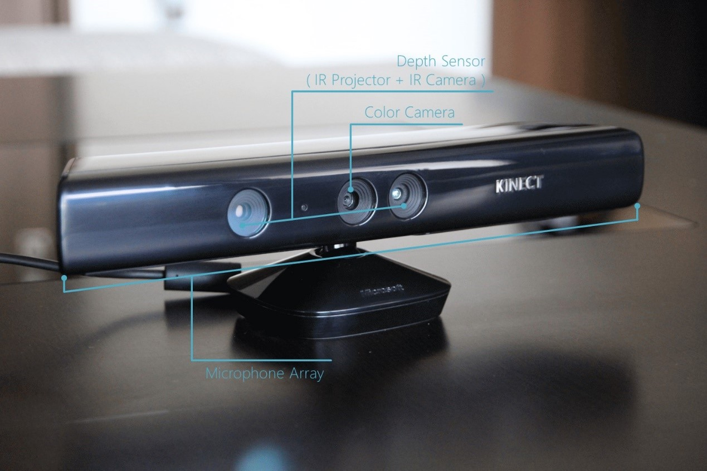
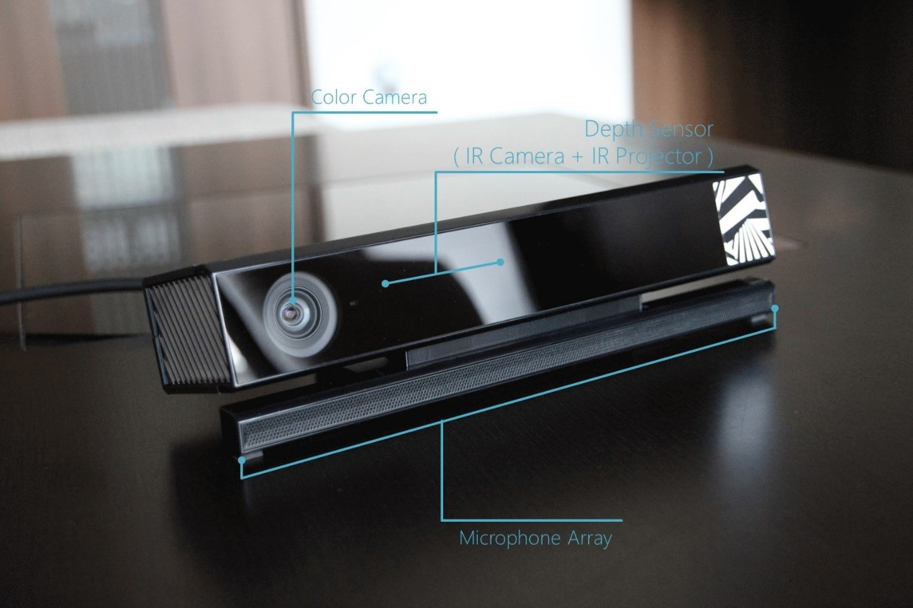
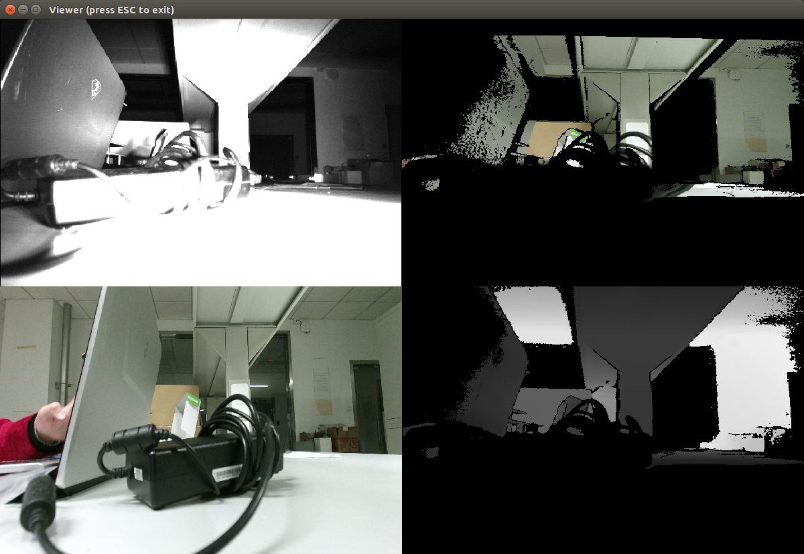
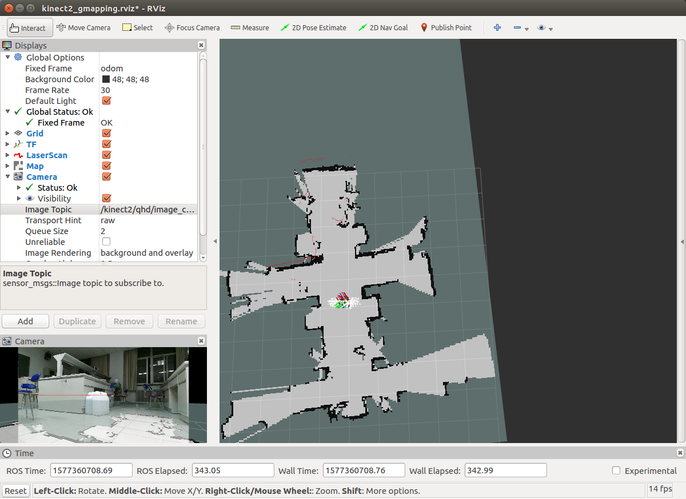
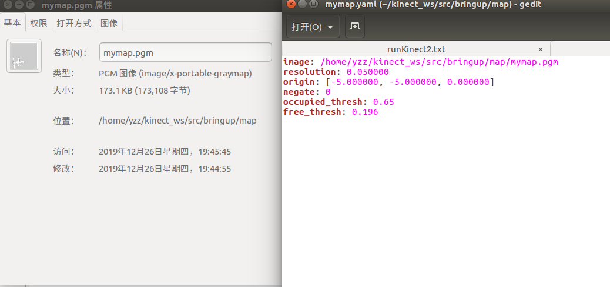
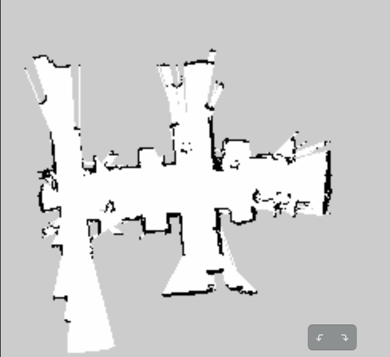
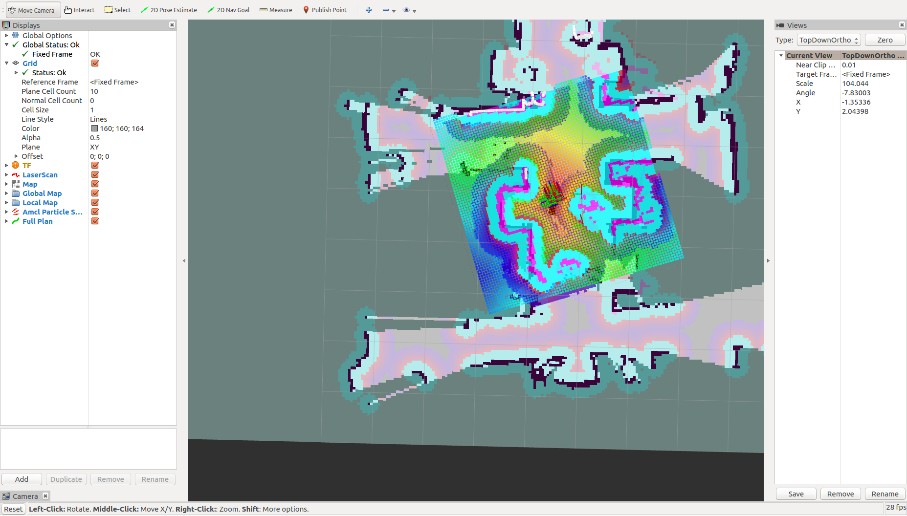

# TurtleBot 2 实体机器人初探

上一章我们在gazebo、RViz环境中仿真TurtleBot 2，接下来，我们使用相似的逻辑来操作一个真实TurtleBot 2。本章架构和上一章几乎一样，再次建议，完成本章后不妨对比一下仿真和实体机器人操作的区别。

本章硬件包括：Kinect V2，TurtleBot 2，一台安装放在TurtleBot 2上的工控机（以下与TurtleBot 2机器人合称为**TurtleBot**），一台远程控制的电脑（以下简称**PC**）。

## Kinect 简介

Kinect/kɪn'ɛkt/是微软公司推出的一款深度摄像头，除了一般摄像头可以采集的RGB图像信息，它还可以采集深度信息，所以也叫RGB-D摄像头。2010年Kinect V1推出，促进了深度摄像头的市场化，减少了成本。TurtleBot 2默认使用的Kinect也是V1。随着2014年Kinect V2的发布，微软宣布将停产Kinect V1。尽管市面上仍有Kinect V1出售，但为了与时俱进，以及更好的性能，我们将在本教程中选用Kinect V2。

<center class="half">
      
</center>
<center>图6.1 Kinect V1与V2外观</center>

关于两代Kinect之间的区别，在此简要介绍一下成像技术。Kinect V1采用的是以色列PrimeSense公司开发的Light Coding；而Kinect V2采用的则是Time-of-Flight（TOF），顾名思义，就是通过投射红外，根据其反射时间来取得深度信息，类似于红外避障的传感器。具体性能差异如图6.2。 

<div align=center>

</div>
<center>图6.2 Kinect V1与Kinect V2参数对比
</center>

## Kinect V2安装

通过查看TurtleBot 2的launch文件，我们可以发现，它默认包含了3种深度传感器的配置，其中就有Kinect V1。但遗憾的是，并没有我们要使用的2代，所以我们需要现在Ubuntu下安装它的驱动，在安装ROS下Kinect V2的相关功能包。

<font color=blue>注意：</font> Kinect V2最终是要连接TurtleBot机器人，所以它的驱动需要安装在用于控制TurtleBot机器人的<font color=red>**工控机**</font>上！且不支持USB 2.0，需要使用<font color=red>USB 3.0</font>，此外虚拟机可能也无法工作。

### libfreenect2安装

首先需要安装Kinect V2的驱动——libfreenect2[^1] 。如果需要使用Kinect V1或者Kinect for Xbox 360，则需要安装libfreenect1。我们参照github的指示来进行安装。

[^1]: [https://github.com/OpenKinect/libfreenect2](https://github.com/OpenKinect/libfreenect2) 

首先在根目录下载libfreenect2的源代码，再进入libfreenect2文件夹。

```shell
$ git clone https://github.com/OpenKinect/libfreenect2.git
$ cd libfreenect2
```

安装相关的依赖项

```shell
$ sudo apt-get install build-essential cmake pkg-config libturbojpeg libjpeg-turbo8-dev mesa-common-dev freeglut3-dev libxrandr-dev libxi-dev
```

安装libusb，这是一个跨平台可移植的，用于USB设备访问的C语言库[^2]。

[^2]: [https://libusb.info/](https://libusb.info/)

```shell
$ sudo apt-add-repository ppa:floe/libusb
$ sudo apt-get update
$ sudo apt-get install libusb-1.0-0-dev
```

安装GLFW3，它是用于OpenGL、OpenGL ES和Vulkan应用程序开发的库。

```shell
$ sudo apt-get install libglfw3-dev
```

之后，在libfreenect2的根目录下进行编译。

```shell
$ cd ~/libreenect2
$ mkdir build && cd build
$ cmake..
$ make
$ sudo make install
```

为设备访问设置udev规则。

```shell
$ sudo cp ../platform/linux/udev/90-kinect2.rules /etc/udev/rules.d/
```

安装完成后，进行测试。将Kinect V2与工控机连接，运行build/bin下面的Protonect测试设备是否正常使用。

```shell
$ ./bin/Protonect
```

如出现图像，则说明Kinect V2驱动安装完成。

<div align=center>

</div>

<center>图6.3 Kinect V2测试
</center>

### iai_kinect2安装

但仅仅安装了Kinect V2的驱动还不够，为了能在ROS中使用Kinect V2，我们还需要一些库和工具，在这里我们安装iai-kinect包[^3]，它是Kinect 2与ROS的接口。

[^3]: [https://github.com/code-iai/iai_kinect2](https://github.com/code-iai/iai_kinect2)

**<font color=blue>注意：</font>** 以下操作均是在TurtleBot的**工控机**中进行。

首先创建在\home目录下创建Kinect 2的工作空间，之后，*我们的程序都会放在kinect2_ws这个工作空间*。

```shell
$ cd
$ mkdir kinect2_ws && cd kinect2_ws
$ mkdir src && cd kinect2_ws
$ catkin_init_workspace # 初始化空间
```

将iai_kinect2克隆进该空间。

```shell
$ git clone https://github.com/code-iai/iai_kinect2.git
$ cd iai_kinect2
$ rosdep install -r --from-paths .   # 安装依赖项
$ cd ~/kincet2_ws
$ catkin_make -DCMAKE_BUILD_TYPE="Release"  # 编译环境
$ rospack profile
```

### 测试

首先将刚才创建好的kinect2_ws添加进环境变量，方便后续操作。

```shell
$ echo "source ~/kinect2_ws/devel/setup.bash" >> ~/.bashrc
$ rospack profile
```

将工控机与Kinect V2连接后，打开终端运行`kinect2_bridge`。

```shell
$ roslaunch kinect2_bridge kinect2_bridge.launch
```

查看启动结果。

```shell
$ rosrun kinect2_viewer kinect2_viewer kinect2 sd cloud
```

如出现Kinect的画面，则说明运行成功。你可以试试使用查看当前启动的节点与话题。

<div align=center>

</div>

<center>图6.4 kinect2_viewer
</center>

## TurtleBot 2安装

和仿真一样，在PC和TurtleBot中都需要安装TurtleBot的二进制文件。

```shell
$ sudo apt-get install ros-kinect-turtlebot-*
```

### 基本说明

再次提醒，以下操作，我们将TurtleBot 2与工控机合称为TurtleBot，将远程控制的电脑称为PC。

为了能使用PC远程控制TurtleBot，我们需要进行网络的配置，使用**SSH** (Secure Shell)远程登录。可以在TurtleBot中输入以下命令安装ssh server来开放ssh服务:

```shell
$ sudo apt-get install openssh-server
```

然后在PC端就可以使用ssh登录TurtleBot，从而进行远程操作。这一步很关键，以后会经常使用。

```shell
$ ssh TURTLEBOT@IP_OF_TURTLEBOT
```

为了方便后续操作，在此进行一些定义与说明。

|        | 远程主机 | TurTleBot 2上的工控机 |
| ------ | -------- | --------------------- |
| 简称   | PC       | TurtleBot             |
| 用户名 | PC       | TURTLEBOT             |
| IP地址 | IP_OF_PC | IP_OF_TURTLRBOT       |

**<font color=red>说明：</font>**  
1. 表格中全大写的用户名和IP地址，操作时都需要换成自己的对应的用户名和IP地址。
2. 后文所说在TurtleBot中进行操作，是指在PC上打开一个终端，通过ssh远程登录TurtleBot，然后在**该终端**进行操作。

### 配置网络

为了能使用PC远程控制TurtleBot，在此我们需要事先配置网络，将TurtleBot的工控机与PC连接到同一个网络，例如手机热点，路由器，*不建议使用校园网*。在这里参考ROS wiki进行网络配置[^4]。

[^4]: [http://wiki.ros.org/turtlebot/Tutorials/indigo/Network%20Configuration](http://wiki.ros.org/turtlebot/Tutorials/indigo/Network%20Configuration)

- PC为主机，在终端中输入`gedit ~/.bashrc`编辑.bashrc文件，在末尾添加以下指令，当然也可以直接在命令行中使用`echo`和`>>`进行添加。

```shell
export ROS_MASTER_URI=http://localhost:11311
export ROS_HOSTNAME=IP_OF_TURTLEBOT
```

- 可以使用远程打开的TurtleBot，或者直接在TurtleBot上面修改.bashrc文件，在文件末尾添加：

```shell
export ROS_MASTER_URI=http://IP_OF_TURTLEBOT:11311
export ROS_HOSTNAME=IP_OF_PC
```

### 安装功能包

由于TurtleBot 2代码默认支持的Kinect是V1，为了使用Kinect V2完成后续的建图和导航，需要进行一些更改。所有的程序已放置github，或者在前言的链接下载。这里在之前创建的Kinect2的工作空间中克隆后续需要的软件包。

```shell
$ cd ~/kinect2_ws/src # 进入先前创建的工作空间
$ git clone
```

编译完成后可以查看工作空间的目录树，了解其结构。

## 移动TurtleBot

配置好网络后，和仿真一样，我们第一个任务就是通过键盘控制TurtleBot。在第五章，我们先在Gazebo中启动了一个虚拟的TurtleBot 2，然后运行键盘控制节点。现在我们在现实中启动TurtleBot 2，再是键盘控制节点。

在**TurtleBot**中打开新终端，连接机器人，启动底盘

```shell
$ roslaunch turtlebot_bringup minimal.launch
```

在**PC**中打开新终端，启动键盘控制

```shell
$ roslaunch turtlebot_teleop keyboard.launch
```

之后便出现了熟悉的界面，你可以使用键盘来控制机器人移动。
整个流程如下：

|           PC           |  TurtleBot  |
| :--------------------: | :---------: |
|                        | 1. 启动底盘 |
| 2. 运行keyboard.launch |             |


## 使用gmapping创建地图

和仿真一样，我们仍使用gmapping来进行SLAM，在仿真中我们使用的命令是

这个launch文件看似非常简单，

现在我们使用Kinect V2，需要运行的是kienct2_ws下`bringup`包里的`kinect2_gmapping.launch`，这个launch文件主要包含了3个功能：

1. 启动Kinect 2的驱动节点。这是一个嵌套的launch文件，位于iai_kinect2中，通过它来驱动Kinect 2。
```xml
<!-- 启动kinect２驱动节点　-->            
    <include file="$(find kinect2_bridge)/launch/kinect2_bridge.launch">
        <arg name="base_name"         value="kinect2"/>
        <arg name="sensor"            value=""/>     
        <arg name="publish_tf"        value="true"/>
        <arg name="base_name_tf"      value="kinect2"/>
        <arg name="fps_limit"         value="-1.0"/>
        <arg name="calib_path"        value="$(find kinect2_bridge)/data/"/>
        <arg name="use_png"           value="false"/>
        <arg name="jpeg_quality"      value="90"/>
        <arg name="png_level"         value="1"/>
        <arg name="depth_method"      value="default"/>
        <arg name="depth_device"      value="-1"/>
        <arg name="reg_method"        value="default"/>
        <arg name="reg_device"        value="-1"/>
        <arg name="max_depth"         value="12.0"/>
        <arg name="min_depth"         value="0.1"/>
        <arg name="queue_size"        value="5"/>
        <arg name="bilateral_filter"  value="true"/>
        <arg name="edge_aware_filter" value="true"/>
        <arg name="worker_threads"    value="4"/>
    </include>  
```

2. 启动`depthimage_to_laserscan`节点，该节点将深度摄像头的深度信息，基于提供的参数，转换成2D的激光扫描信息，用于建图。这么做是因为gmapping不能直接使用3D的深度信息来建图。
```xml
<node pkg="depthimage_to_laserscan" type="depthimage_to_laserscan" name="depthimage_to_laserscan" output="screen">
    <!--输入图像-->
    <remap from="image" to="/kinect2/qhd/image_depth_rect"/>
    <!--相关图像的相机信息。通常不需要重新变形，因为camera_info将从与图像相同的命名空间订阅。-->
    <remap from="camera_info" to="/kinect2/qhd/camera_info" />
    <!--输出激光数据的话题-->
    <remap from="scan" to="/scan" /> 

    <!--激光扫描的帧id。对于来自具有Z向前的“光学”帧的点云，该值应该被设置为具有X向前和Z向上的相应帧。-->
    <param name="output_frame_id" value="/kinect2_depth_frame"/>
    <!--用于生成激光扫描的像素行数。对于每一列，扫描将返回在图像中垂直居中的那些像素的最小值。-->
    <param name="scan_height" value="30"/>
    <!--返回的最小范围（以米为单位）。小于该范围的输出将作为-Inf输出。-->
    <param name="range_min" value="0.45"/>
    <!--返回的最大范围（以米为单位）。大于此范围将输出为+ Inf。-->
    <param name="range_max" value="8.00"/>
  </node>
```

3. 启动gmapping节点。前面的步骤都是为了这一步铺垫。我们只需要在launch文件中加入这一段就可以使用gmapping建图。
```xml
<node pkg="gmapping" type="slam_gmapping" name="simple_gmapping" output="screen">
        <param name="map_update_interval" value="5.0"/>  
        <param name="maxUrange" value="5.0"/> 
        <param name="maxRange" value="6.0"/> 
        <param name="sigma" value="0.05"/>  
        <param name="kernelSize" value="1"/>  
        <param name="lstep" value="0.05"/>  
        <param name="astep" value="0.05"/>  
        <param name="iterations" value="5"/>  
        <param name="lsigma" value="0.075"/>  
        <param name="ogain" value="3.0"/>  
        <param name="lskip" value="0"/>  
        <param name="minimumScore" value="50"/>  
        <param name="srr" value="0.1"/>  
        <param name="srt" value="0.2"/>  
        <param name="str" value="0.1"/>  
        <param name="stt" value="0.2"/>  
        <param name="linearUpdate" value="1.0"/>  
        <param name="angularUpdate" value="0.5"/>  
        <param name="temporalUpdate" value="3.0"/>  
        <param name="resampleThreshold" value="0.5"/>  
        <param name="particles" value="50"/>  
        <param name="xmin" value="-5.0"/>  
        <param name="ymin" value="-5.0"/>  
        <param name="xmax" value="5.0"/>  
        <param name="ymax" value="5.0"/>  
        <param name="delta" value="0.05"/>  
        <param name="llsamplerange" value="0.01"/>  
        <param name="llsamplestep" value="0.01"/>  
        <param name="lasamplerange" value="0.005"/>  
        <param name="lasamplestep" value="0.005"/>  
    </node>
```

简要说明了该文件，我们在Turtlebot中输入以下命令就可以来建图了：
```shell
$ roslaunch bringup kinect2_gmapping.launch
```

为了看见建图的过程，我们配置好了RViz的可视化选项，将其保存在`bringup`包中的`rviz`文件夹，并使用`kinect2_gmapping_rviz_view.launch`加载RViz节点及配置文件。
```xml
<launch>
    <!--start rviz view -->
    <node name="rviz" pkg="rviz" type="rviz" args="-d $(find bringup)/rviz/kinect2_gmapping.rviz" />
</launch>
```

使用以下命令运行。
```shell
$ roslaunch bringup kinect2_gmapping_rviz_view.launch
```

使用键盘控制机器人移动，你可以看见RViz地图越来越大，越来越清晰。

<div align=center>

</div>

<center>图6.5 RViz建图过程
</center>

以上步骤，如下所示：

|           PC           |  TurtleBot  |
| :--------------------: | :---------: |
|                        | 1. 启动底盘 |
| 2. 运行keyboard.launch |             |
|  |  3. 运行 kinect2_gmapping.launch          |
|4. kinect2_gmapping_rviz_view.launch   |     |

当你觉得当前的地图较为理想后，使用`map_server`将地图保存在`bringup/map`文件夹下，若不指定路径则默认保存在主文件夹下。
```shell
$ rosrun map_server map_saver -f /home/用户名/kinect2_ws/src/bringup/map/mymap
```

建好的地图包含pgm文件和yaml文件，后者包含了地图文件的路径，需要注意的是，这是一个**绝对路径**，在保存和引用地图时也需要这么写，不可写成`~/用户名/kinect2_ws/`。

<div align=center>

</div>

<div align=center>

</div>

<center>图6.6 建图结果
</center>

## 自主导航

接着，我们使用建好的地图来进行导航。

导航的启动文件是位于`bringup/launch`中的`kinect2_navigation.launch`，这个文件除了和gmapping中一样驱动Kinect2，将深度数据转换成2D激光扫描数据外，还实现了三个功能：

1. 载入扫描好的地图。运行`map_server`节点，将创建好的地图的**yaml**文件加载参数的位置（不是pgm）。这个文件放在map下面。
```xml
<node name="map_server" pkg="map_server" type="map_server" args="$(find bringup)/map/mymap.yaml"/>
```

2. 启动amcl节点，用于定位。我们使用了用于Kinect 1导航的配置文件，实际上也是可以使用的。
```xml
  <arg name="custom_amcl_launch_file" default="$(find turtlebot_navigation)/launch/includes/amcl/kinect_amcl.launch.xml"/>
  <arg name="initial_pose_x" default="0.0"/> 
  <arg name="initial_pose_y" default="0.0"/> 
  <arg name="initial_pose_a" default="0.0"/>
  <include file="$(arg custom_amcl_launch_file)">
    <arg name="initial_pose_x" value="$(arg initial_pose_x)"/>
    <arg name="initial_pose_y" value="$(arg initial_pose_y)"/>
    <arg name="initial_pose_a" value="$(arg initial_pose_a)"/>
  </include>
```

3. 启动move base节点，用于实现最优路径规划。
```xml
<arg name="custom_param_file" default="$(find turtlebot_navigation)/param/kinect_costmap_params.yaml"/>
<include file="$(find turtlebot_navigation)/launch/includes/move_base.launch.xml">
    <arg name="custom_param_file" value="$(arg custom_param_file)"/>
</include>
```

输入以下命令启动导航：
```shell
$ roslaunch bringup kinect2_navigation.launch
```

再使用RViz查看导航的过程。
```shell
$ roslaunch bringup kinect2_navigation_view.launch
```

和仿真一样，在RViz中使用2D nav选取目标位置，就可以看见机器人缓缓地移动过去了。

<div align=center>

</div>
<center>图6.7 navigation
</center>

**注意：** 导航时，最好将机器人放在与建图差不多的起始位置和朝向，便于机器人定位。

以上步骤，如下所示：

|           PC           |  TurtleBot  |
| :--------------------: | :---------: |
|                        | 1. 启动底盘 |
| 2. kinect2_navigation.launch |             |
|3. kinect2_navigation_rviz_view.launch   |     |

## 总结与拓展

至此，本书实验内容已全部结束，希望你已经顺利完成。
