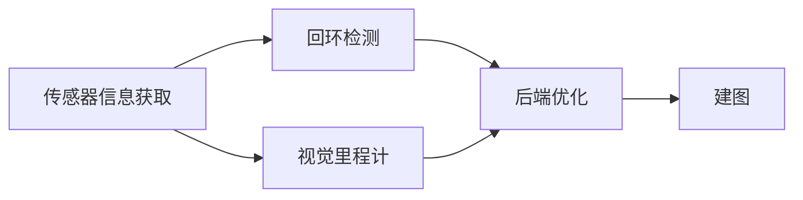
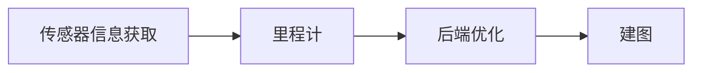
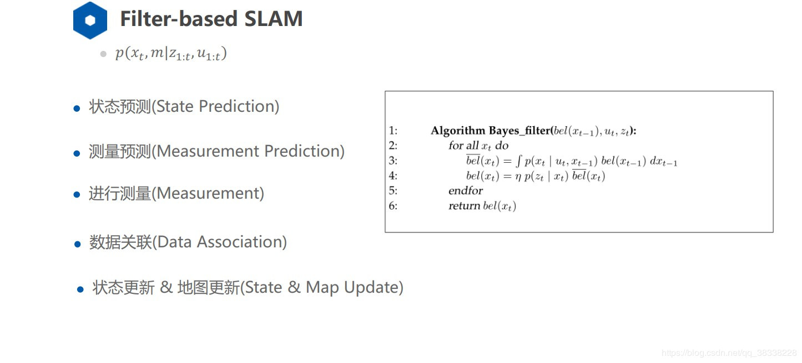
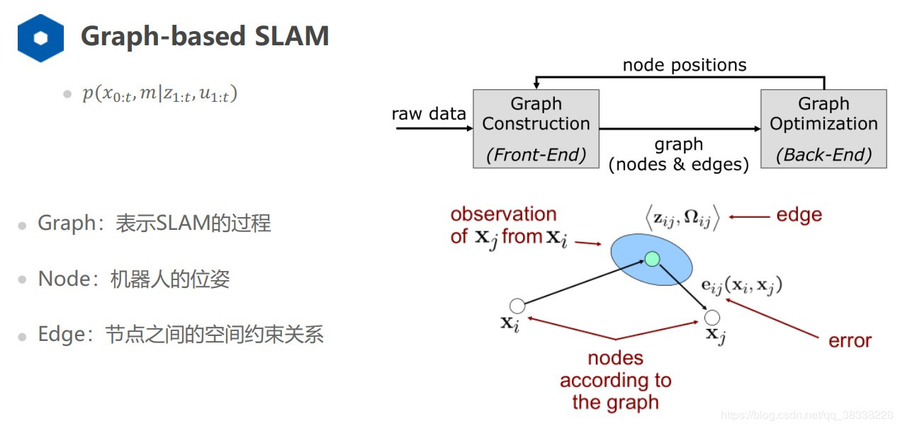
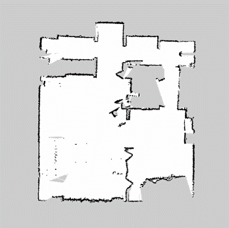
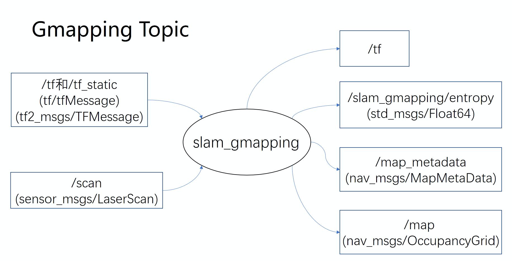

# 7 SLAM基础

## 7.1 SLAM简介

### 7.1.1 SLAM的概念

**SLAM **(simultaneous localization and mapping)，也称为CML (Concurrent Mapping and Localization), 即时定位与地图构建，或并发建图与定位。它是指搭载特殊传感器的主体，在没有环境先验信息信息的情况下，于运动过程中建立环境的模型，同时估计自己的运动。

这是似乎一个很直观的问题，我们自己走入陌生的环境时不就是这么做的吗？感知周围的环境再控制自己的运动。

机器人要做到这一点至少需要知道两件事：

1. 我在什么地方？——**定位**
2. 周围环境是什么样？——**建图**

SLAM所要解决的就是这两个问题

### 7.1.2 SLAM的用途
目前，SLAM技术主要被运用于无人机、无人驾驶、机器人、AR、智能家居等领域，从各应用场景入手，促进消费升级。

### 7.1.3 传感器

当我们谈论SLAM时，最先问到的就是传感器。SLAM的实现方式与难度和传感器的形式与安装方式密切相关。传感器分为**激光**和**视觉**两大类，视觉下面又分三小方向。

**(1) 激光雷达**

激光雷达是最古老，也是研究最多的SLAM传感器。它们提供机器人本体与周围环境障碍物间的距离信息。常见的激光雷达，例如SICK、Velodyne还有我们国产的rplidar等，都可以拿来做SLAM。激光雷达能以很高精度测出机器人周围障碍点的角度和距离，从而很方便地实现SLAM、避障等功能。

**(2) 视觉（相机）**

视觉SLAM研究主要分为三大类：单目、双目（或多目）和RGBD。其余还有鱼眼、全景等特殊相机，但是在研究和产品中都属于少数。此外，结合惯性测量器件（Inertial Measurement Unit，IMU）的视觉SLAM也是现在研究热点之一。就实现难度而言，我们可以大致将这三类方法排序为：

<center> 单目视觉>双目视觉>RGBD </center>

单目相机SLAM简称MonoSLAM，即只用一支摄像头就可以完成SLAM。这样做的好处是传感器特别的简单、成本特别的低，所以单目SLAM非常受研究者关注。相比别的视觉传感器，单目有个最大的问题，就是没法确切地得到深度。这是一把双刃剑。

双目相机通过多个相机之间的基线，估计空间点的位置。与单目不同的是，立体视觉既可以在运动时估计深度，亦可在静止时估计，消除了单目视觉的许多麻烦。不过，双目或多目相机配置与标定均较为复杂，其深度量程也随双目的基线与分辨率限制。通过双目图像计算像素距离，是一件非常消耗计算量的事情，现在多用FPGA来完成。

RGBD相机是2010年左右开始兴起的一种相机，它最大的特点是可以通过红外结构光或Time-of-Flight原理，直接测出图像中各像素离相机的距离。因此，它比传统相机能够提供更丰富的信息，也不必像单目或双目那样费时费力地计算深度。目前常用的RGBD相机包括Kinect/Kinect V2、Xtion等。不过，现在多数RGBD相机还存在测量范围窄、噪声大、视野小等诸多问题。出于量程的限制，主要用于室内SLAM。

## 7.2 SLAM框架

SLAM通常包括如下几个部分，特征提取，数据关联，状态估计，状态更新以及特征更新等。

翻译一下大概就是，当你来到一个陌生的环境时，为了迅速熟悉环境并完成自己的任务（比如找饭馆，找旅馆），你应当做以下事情：

1. 用眼睛观察周围地标如建筑、大树、花坛等，并记住他们的特征（特征提取）

2. 在自己的脑海中，根据双目获得的信息，把特征地标在三维地图中重建出来（三维重建）

3. 当自己在行走时，不断获取新的特征地标，并且校正自己头脑中的地图模型（bundle adjustment or EKF）

4. 根据自己前一段时间行走获得的特征地标，确定自己的位置（轨迹）

5. 当无意中走了很长一段路的时候，和脑海中的以往地标进行匹配，看一看是否走回了原路（回环检测）。实际这一步可有可无。

以上五步是**同时**进行的，因此是simultaneous localization and mapping。

### 7.2.1 视觉SLAM基本框架

视觉SLAM几乎都有一个基本的框架 。一个SLAM系统分为四个模块（除去传感器数据读取）：视觉里程计、后端、建图、回环检测。




<center>图7.1 视觉SLAM基本框架</center>

**(1) 视觉里程计 (Visual Odometry)**

它估计两个时刻机器人的相对运动（Ego-motion）。在激光SLAM中，我们可以将当前的观测与全局地图进行匹配，用ICP求解相对运动。而对于相机，它在欧氏空间里运动，图像在计算机中只是一个数值矩阵（矩阵中代表着什么东西是机器学习要解决的问题）在视觉SLAM中，我们只能看到一个个像素点，知道它们是某些空间点在相机的成像平面投影的结果。故定量的估计相机的运动，必须先了解相机与空间点的几何关系。

我们经常需要估计一个三维空间的变换矩阵。求解这个矩阵是VO的核心问题，而求解的思路，则分为**基于特征的方法**和**不使用特征的直接方法**。

基于特征的方法是目前VO的主流方式。对于两幅图像，首先提取图像中的特征，然后根据两幅图的特征匹配，计算相机的变换矩阵。最常用的是点特征，例如Harris角点、SIFT、SURF、ORB。如果使用RGBD相机，利用已知深度的特征点，就可以直接估计相机的运动。给定一组特征点以及它们之间的配对关系，求解相机的姿态，该问题被称为PnP问题（Perspective-N-Point）。PnP可以用非线性优化来求解，得到两个帧之间的位置关系。

不使用特征进行VO的方法称为直接法。它直接把图像中所有像素写进一个位姿估计方程，求出帧间相对运动。例如，在RGBD SLAM中，可以用ICP（Iterative Closest Point，迭代最近邻）求解两个点云之间的变换矩阵。对于单目SLAM，我们可以匹配两个图像间的像素，或者像图像与一个全局的模型相匹配。直接法的典型例子是SVO和LSD-SLAM。它们在单目SLAM中使用直接法，取得了较好的效果。目前看来，直接法比特征VO需要更多的计算量，而且对相机的图像采集速率也有较高的要求。

**简单来说，就是确定利用采集到的环境的特征，确定自己在特定坐标系下两个时刻之间的位移向量。**

**(2) 后端优化：**

在VO估计帧间运动之后，理论上就可以得到机器人的轨迹了。然而视觉里程计和普通的里程计一样，存在累积误差的问题（Drif）。直观地说，在t1和t2时刻，估计的转角比真实转角少1度，那么之后的轨迹就全部少掉了这1度。时间一长，建出的房间可能由方形变成了多边形，估计出的轨迹亦会有严重的漂移。所以在SLAM中，还会把帧间相对运动放到一个称之为后端的程序中进行加工处理。

早期的SLAM后端使用滤波器方式。由于那时还未形成前后端的概念，有时人们也称研究滤波器的工作为研究SLAM。SLAM最早的提出者R. Smith等人就把SLAM建构成了一个EKF（Extended Kalman Filter，扩展卡尔曼滤波）问题。他们按照EKF的形式，把SLAM写成了一个运动方程和观测方式，以最小化这两个方程中的噪声项为目的，使用典型的滤波器思路来解决SLAM问题。

当一个帧到达时，我们能（通过码盘或IMU）测出该帧与上一帧的相对运动，但是存在噪声，是为运动方程。同时，通过传感器对路标的观测，我们测出了机器人与路标间的位姿关系，同样也带有噪声，是为观测方程。通过这两者信息，我们可以预测出机器人在当前时刻的位置。同样，根据以往记录的路标点，我们又能计算出一个卡尔曼增益，以补偿噪声的影响。于是，对当前帧和路标的估计，即是这个预测与更新的不断迭代的过程。

21世纪之后，SLAM研究者开始借鉴SfM（Structure from Motion）问题中的方法，把捆集优化（Bundle Adjustment）引入到SLAM中来。优化方法和滤波器方法有根本上的不同。它并不是一个迭代的过程，而是考虑过去所有帧中的信息。通过优化，把误差平均分到每一次观测当中。在SLAM中的Bundle Adjustment常常以图的形式给出，所以研究者亦称之为图优化方法（Graph Optimization）。图优化可以直观地表示优化问题，可利用稀疏代数进行快速的求解，表达回环也十分的方便，因而成为现今视觉SLAM中主流的优化方法。

**直观地说，就是对累计的误差进行滤波优化。**

**(3) 回环检测**

又称闭环检测（Loop closure detection），是指机器人识别曾到达场景的能力。如果检测成功，可以显著地减小累积误差。回环检测实质上是一种检测观测数据相似性的算法。对于视觉SLAM，多数系统采用目前较为成熟的词袋模型（Bag-of-Words, BoW）。词袋模型把图像中的视觉特征（SIFT, SURF等）聚类，然后建立词典，进而寻找每个图中含有哪些“单词”（word）。也有研究者使用传统模式识别的方法，把回环检测建构成一个分类问题，训练分类器进行分类。

回环检测的难点在于，错误的检测结果可能使地图变得很糟糕。这些错误分为两类：1.假阳性（False Positive），又称感知偏差（Perceptual Aliasing），指事实上不同的场景被当成了同一个；2.假阴性（False Negative），又称感知变异（Perceptual Variability），指事实上同一个场景被当成了两个。感知偏差会严重地影响地图的结果，通常是希望避免的。一个好的回环检测算法应该能检测出尽量多的真实回环。研究者常常用准确率-召回率曲线来评价一个检测算法的好坏。

**简单来说，就是判断机器人是否到过当前位置，可通过判断数据相似性来检测。**

**(4) 建图**

对于建图，没有一个固定的形式和算法。地图的形式随SLAM的应用场合而定。大体上分为：度量地图、拓扑地图。度量地图强调精确地表示地图中物体的位置关系，通常用稀疏和稠密对其分类。

### 7.2.2 激光SLAM基本框架

激光SLAM的基本框架和视觉SLAM基本框架相差不大，只是不需要回环检测这一模块，视觉里程计改为里程计。

根据后端优化的不同方式分为滤波SLAM以及图优化SLAM。

滤波SLAM的框架图如下：



<center>图7.2 激光SLAM基本框架</center>

根据后端优化的不同方式分为**滤波SLAM**以及**图优化SLAM**。

**(1) 滤波SLAM**

<div align=center>

</div>

<center>图7.3 滤波SLAM框架 </center>

二维激光滤波SLAM的算法有：EKF-SLAM（90年代）、FastSLAM（02～03年）、Gmapping（07年）、Optimal RBPF（10年）。所以我们实验中所使用的gmapping就是二维激光滤波。

**(2) 图优化SLAM**

<div align=center>

</div>

<center>图7.4 图优化SLAM框架 </center>

二维激光图优化SLAM的算法有：Globally Consistent Range Scan For Environment Mapping（97年）、Incremental Mapping of Large Cyclic Environments（99年）、Karto SLAM（10年）、Cartographer（16年）。Google的Cartographer就是其中的代表，ROS中也有相应的功能包来完成Cartographer。

## 7.3 ROS中的SLAM

也许看了前两节，你可能还是云里雾里，不用担心，对于SLAM，本书只求运用，不必过多关注其原理。接下来，我们来看一下ROS中SLAM的一些功能包，它们用于实现一些常用的SLAM算法，例如Gmapping、Karto、Hector、Cartographer等。

这一节我们不会去关注算法背后的数学原理（上一节中简单讲了一下），而是更注重工程实现上的方法。虽然在前两章的实验中你已经不知不觉使用了，但本章将告诉你SLAM算法包是如何工作的，怎样快速的搭建起SLAM算法。我们主要讲解实验中所使用的gmapping算法。

### 7.3.1 地图

机器人导航地图有很多，在这里我们介绍**二维占用网格地图**（Occupancy Grid Map），这也是我们所使用的地图。二维占用网格地图就是一张普通的灰度图像，通常为pgm格式，同时还有一个yaml文件包含地图信息。这张图像上的黑色像素表示占用区域，白色像素表示可行区域，灰色是未探索的区域。相信通过前两章的实验，你已经见过地图的pgm图片以及ymal文件了。

每个区域都是用0到255的灰度值来表示的，这个值表示的是占用概率。越接近1，它被占用的概率就越大，颜色就越深；反之越浅。

<div align=center>

</div>

<center>图7.5 地图示例 </center>

在SLAM建图的过程中，你可以在RViz里看到一张地图被逐渐建立起来的过程，类似于一块块拼图被拼接成一张完整的地图。这张地图对于我们定位、路径规划都是不可缺少的信息。事实上，地图在ROS中是以Topic的形式维护和呈现的，这个Topic名称就叫做`/map`，它的消息类型是`nav_msgs/OccupancyGrid`。

### 7.3.2 锁存

由于`/map`中实际上存储的是一张图片，为了减少不必要的开销，这个Topic往往采用锁存（latched）的方式来发布。

锁存的意思是：地图如果没有更新，就维持着上次发布的内容不变，此时如果有新的订阅者订阅消息，这时只会收到一个`/map`的消息，也就是上次发布的消息；只有地图更新了（比如SLAM又建出来新的地图），这时`/map`才会发布新的内容。

锁存器的作用就是，*将发布者最后一次发布的消息保存下来，然后把它自动发送给后来的订阅者*。这种方式非常适合变动较慢、相对固定的数据（例如地图），然后只发布一次，相比于同样的消息不定的发布，锁存的方式既可以减少通信中对带宽的占用，也可以减少消息资源维护的开销。

### 7.3.3 nav_msgs/OccupancyGrid

然后我们来看一下地图的OccupancyGrid类型是如何定义的。

你可以通过以下任意一条命令来查看消息类型
```shell
$ rosmsg show nav_msgs/OccupancyGrid # 查看消息

$ rosed nav_msgs OccupancyGrid.msg # 查看srv文件。
```

在ROS基础这一章中，我们已经说过，消息可以看做是数据结构，打开后你就能更加理解这句话。

```yaml
std_msgs/Header header #消息的报头
    uint32 seq
    time stamp
    string frame_id 		#地图消息绑定在TF的哪个frame上，一般为map
nav_msgs/MapMetaData info 	#地图相关信息
    time map_load_time 		#加载时间
    float32 resolution 		#分辨率 单位：m/pixel
    uint32 width 			#宽 单位：pixel
    uint32 height 			#高 单位：pixel
    geometry_msgs/Pose origin 	#原点
        geometry_msgs/Point position
            float64 x
            float64 y
            float64 z
        geometry_msgs/Quaternion orientation
            float64 x
            float64 y
            float64 z
            float64 w
int8[] data 		#地图具体信息

```

这个srv文件定义了`/map`话题的数据结构，包含了三个主要的部分：header, info和data。

header是消息的报头，保存了序号、时间戳、frame等通用信息，info是地图的配置信息，它反映了地图的属性，data是真正存储这张地图数据的部分，它是一个可变长数组，int8后面加了[]，你可以理解为一个类似于vector的容器，它存储的内容有width$\times$height个int8型的数据,也就是这张地图上每个像素。

### 7.3.4 gmapping功能包

**(1) 原理**

① Gmapping是基于滤波SLAM框架的常用开源SLAM算法。他在RBpf粒子滤波算法上做了两个主要的改进——改进提议分布和选择性重采样。

粒子滤波中最常用的是重要性重采样算法。这个算法通过不断迭代来估计每一时刻机器人的位姿。算法总共包括四个步骤：采样-计算权重-重采样-地图估计。

② Gmapping基于RBpf粒子滤波算法，即将定位和建图过程分离，先进行定位再进行建图。

SALM要解决的问题就是由控制数据$u_{1:t}$ 和观测数据$z_{1:t}$求位姿和地图的联合分布
$$
P(x_{1:t},m|z_{1:t},u_{1:t-1})
$$

将该公式通过条件概率拆分为
$$
P(x_{1:t},m|z_{1:t}, u_{1:t})=P(m|x_{1:t},z_{1:t})P(x_{1:t}|z_{1:t},u_{1:t-1})
$$

则可先得到位姿再建图。

**(2) 功能包**

gmapping功能包集成了相关算法，让我们可以像个黑匣子一样使用。这个软件包位于ros-perception组织中的slam_gmapping[^1]中。 其中的slam_gmapping是一个元功能包，它依赖了gmapping，而算法具体实现都在gmapping软件包中，该软件包中的slam_gmapping程序就是我们在ROS中运行的SLAM节点。如果你感兴趣，可以阅读一下gmapping的源代码。

[^1]: [https://github.com/ros-perception/slam_gmapping](https://github.com/ros-perception/slam_gmapping)
我们前面所安装的桌面完整版的ROS已经自带了gmapping，如果没有，可以使用一下命令来安装。

```shell
$ sudo apt-get install ros-kinetic-gmapping
```

**(3) Gmapping SLAM计算图**

gmapping的作用是根据激光雷达和里程计（Odometry）的信息，对环境地图进行构建，并且对自身状态进行估计。因此它的输入应当包括激光雷达和里程计的数据，而输出应当有自身位姿和二维占用地图。下面我们从计算图（消息的流向）的角度来看看gmapping算法的实际运行中的结构： 

<div align=center>

</div>
<center>图7.6 gmapping计算图 </center>

让我们来说明一下这张图。

slam_gmapping节点

- slam_gmapping节点通过消息sensor_msgs/LaserScan获取数据并建立地图。

- 该创建的地图可以通过ROS主题或者服务方式获取。

节点订阅主题（输入）

- tf 以及tf_static(tf/tfMessage)，类型为第一代的tf/tfMessage或第二代的tf2_msgs/TFMessage其中一定得提供的有两个tf，一个是base_frame与laser_frame之间的tf，即机器人底盘和激光雷达之间的变换；一个是base_frame与odom_frame之间的tf，即底盘和里程计原点之间的坐标变换。odom_frame可以理解为里程计原点所在的坐标系。用于激光器坐标系，基座坐标系，里程计坐标系之间转换。

- scan (sensor_msgs/LaserScan ) ，激光器扫描数据

节点发布主题（输出）

- map_metadata (nav_msgs/MapMetaData)，周期性发布地图meta数据

- map (nav_msgs/OccupancyGrid)，周期性发布地图栅格数据

- ~entropy (std_msgs/Float64)，发布机器人姿态分布熵的估计

- tf (tf/tfMessage)，输出的/tf里又一个很重要的信息，就是map_frame和odom_frame之间的变换，这其实就是对机器人的定位。

服务

- dynamic_map (nav_msgs/GetMap)，调用该服务可以获取地图数据

gmapping功能包中还提供了许多可配置的参数，更改参数需要对机器人性能和算法内部实现有一定了解，在此不加赘述，使用的是默认值。如果需要可以查看Wiki中的参数介绍[^2]以及参考资料中的《ROS机器人开发实践》（胡春旭）第9.3节。

[^2]: [http://wiki.ros.org/gmapping](http://wiki.ros.org/gmapping)

**(4) 里程计误差及修正 **

目前ROS中常用的里程计广义上包括车轮上的光电码盘、惯性导航元件（IMU）、视觉里程计，你可以只用其中的一个作为odom，也可以选择多个进行数据融合，融合结果作为odom。通常来说，实际ROS项目中的里程计会发布两个Topic：

- odom(nav_msgs/Odometry): 反映里程计估测的机器人位置、方向、线速度、角速度信息。

- tf(tf/tfMessage): 主要是输出odom_frame和base_frame之间的tf。这段tf反映了机器人的位置和方向变换，数值与/odom中的相同。

由于以上三种里程计都是对机器人的位姿进行估计，存在着累计误差，因此当运动时间较长时，odom_frame（里程计坐标系）和base_frame之间变换的真实值与估计值的误差会越来越大。gmapping的做法是把里程计误差的修正发布到map_frame和odom_frame之间的tf上，也就是把误差补偿在了地图坐标系和里程计原点坐标系之间。通过这种方式来修正定位。

这样map_frame（地图坐标系）和base_frame（基座坐标系），甚至和laser_frame（传感器坐标系）之间就连通了，实现了机器人在地图上的定位。

### 7.3.5 gmapping例程

使用gmapping实现SLAM，我们只需要使用其提供的接口来实现相关功能。我们以本书代码中的`/kinect_ws/src/launch`文件为例。

